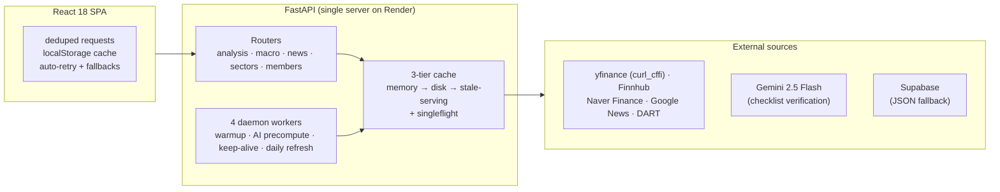

# AI-Powered Stock Analysis Platform

A full-stack platform that combines technical analysis, fundamentals, news, macro regime detection, and **LLM-verified investment checklists** across eight investment themes — AI / semiconductors, robotics, SMR (small modular reactors), cybersecurity, aerospace, biotech, quantum computing, and hydrogen.

Built as a personal project to explore how far LLM agents can go in replacing manual market research — and how to run an AI-heavy pipeline reliably on free-tier data sources and minimal infrastructure.

> **📐 Deep dive: [docs/ARCHITECTURE.md](docs/ARCHITECTURE.md)** — AI pipeline design, caching strategy, rate-limit defense, regime engine, and the trade-offs behind each decision. (Korean)

## System overview



## Engineering highlights

- **LLM as a verifier, not a generator** — a 5-phase pipeline builds a rule-based draft checklist per stock, gathers news + fundamentals + analyst consensus + investor flows in parallel, then has Gemini validate/adjust it (JSON-only output). Hallucination guardrails: metric whitelist, weight caps, minimum item count, deterministic settings (temp 0.2), 12h result cache, graceful rule-based fallback.
- **50+ indicator prediction engine** — trend / momentum / volatility / volume / structure categories, each indicator normalized to −1..+1, aggregated to a −100..+100 verdict with confidence and ATR-based price targets.
- **Composite ranking** — chart score × 0.30 + AI checklist × 0.45 + fundamentals × 0.25, precomputed by a warmup worker so list and detail pages always agree.
- **Rule-based macro regime engine (deliberately no LLM)** — 25 commodities/ratios tracked over 5-year history, classified into 6 persistent regimes (Crash / Rebound / Breakout / Topping / Sleeper / Steady) with state stored across restarts; auto-generates daily/weekly markdown reports when regimes change.
- **Surviving free-tier data sources** — curl_cffi browser impersonation, concurrency semaphores (yfinance ≤2, 0.5s min interval), singleflight deduplication, and stale-cache serving so an upstream outage never becomes a blank screen.
- **Docs as data** — a Karpathy-style LLM wiki where value-chain and commodity-mapping pages are parsed by the backend and served through the API; the regime engine writes its reports back into the wiki ecosystem.

## Tech stack

**Frontend** — Vite, React 18, TypeScript, Tailwind CSS v4, Recharts, React Router, i18next (EN/KO)

**Backend** — Python 3.11, FastAPI, yfinance + curl_cffi, BeautifulSoup, pandas/numpy, Google Gemini API, Finnhub, Supabase (Postgres, with JSON fallback)

**Infra** — Render (persistent disk cache), secrets via environment variables only

## Features

- **Sector dashboard** — eight sectors with curated watch lists, mind-map view, and narrative summaries
- **AI investment checklist** — per-stock checklists wired to live data (commodity prices, financial metrics, peer stocks), verified and scored by Gemini
- **Technical analysis** — RSI, MACD, Bollinger Bands server-side; clean price/volume charts with clickable move-reason annotations (big moves matched to news)
- **Prediction & ranking** — 50+ indicator composite verdicts with category breakdowns, 1-week/1-month targets, and a cross-sector top-10 ranking
- **Macro dashboard** — commodity regime states, sector sentiment from leading indicators, macro news → sector impact mapping, and value-chain maps
- **News feed** — Finnhub + Naver Finance + Google News with deduplication and Gemini relevance analysis
- **Member gate + admin panel** — invite-only access; writes protected by auth middleware, reads public

## Project structure

```
backend/
  main.py                # FastAPI app, ASGI auth middleware, daemon workers, SPA serving
  config.py              # pydantic settings from env
  api/                   # routers: analysis, macro, news, sectors, members
  services/
    stock_data.py            # yfinance wrapper (curl_cffi), memory+disk cache
    technical_analysis.py    # RSI, MACD, Bollinger
    fundamentals.py          # Finnhub (US) + Naver (KR)
    news_crawler.py          # Naver + Google News crawlers
    naver_finance.py         # Naver Finance scraping + mobile JSON APIs
    research.py              # analyst reports, consensus, DART filings
    macro_commodity.py       # commodity feed + signal classification
    macro_regime.py          # scenario/event → sector synthesis
    macro_sentiment.py       # rule-based sector sentiment scoring
    macro_news.py            # macro news → sector impact mapping
    commodity_regime_history.py  # 6-state regime engine, 5y history, report generation
    value_chain_parser.py    # parses wiki value-chain docs into API responses
    runtime_controls.py      # rate-limit semaphores
frontend/
  src/
    api/client.ts        # typed client: dedupedGet, localStorage cache, retry
    data/sectors.ts      # 8 sector definitions
    components/          # dashboard, charts, mind map, macro views, admin
wiki/                    # LLM wiki (compiled knowledge, parsed by backend)
raw/                     # immutable source material
Output/                  # generated reports (regime engine output)
data/                    # sector configs, regime state, member fallback
```

The browser never talks to external APIs or Supabase directly — all data flows through the FastAPI backend, so every key stays server-side.

## Running locally

### Prerequisites
- Python 3.11+, Node.js 20+
- API keys: Google Gemini, Finnhub (optional — features degrade gracefully without them)
- A Supabase project (optional — backend falls back to JSON files)

### Backend

```bash
cd backend
python -m venv venv
source venv/bin/activate
pip install -r requirements.txt

cp ../.env.example ../.env      # SUPABASE_URL, SUPABASE_KEY, GEMINI_API_KEY, FINNHUB_API_KEY
uvicorn main:app --reload       # http://localhost:8000
```

### Frontend

```bash
cd frontend
npm install
npm run dev                     # http://localhost:5173 (proxies /api → :8000)
```

## Security

- All credentials come from environment variables; `.env` is git-ignored (only `.env.example` is tracked)
- Supabase and every external API are reached only from the backend
- Pure-ASGI auth middleware: reads are public, all mutations require a verified member header
- SPA serving returns 404 (not index.html) for stale hashed assets, preventing post-deploy parse errors

## Status

In active development. A small group of peers uses the private deployment as a daily read.
