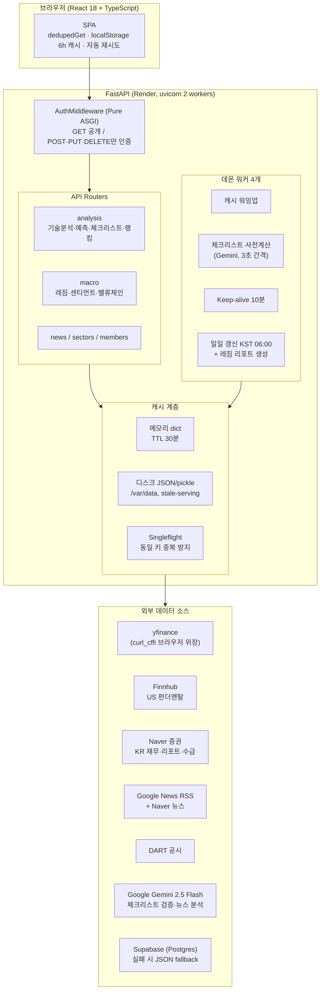
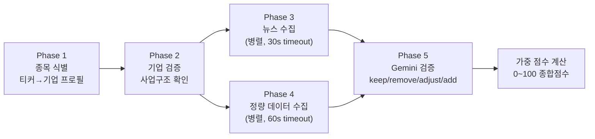
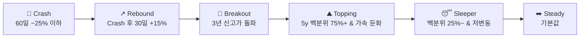
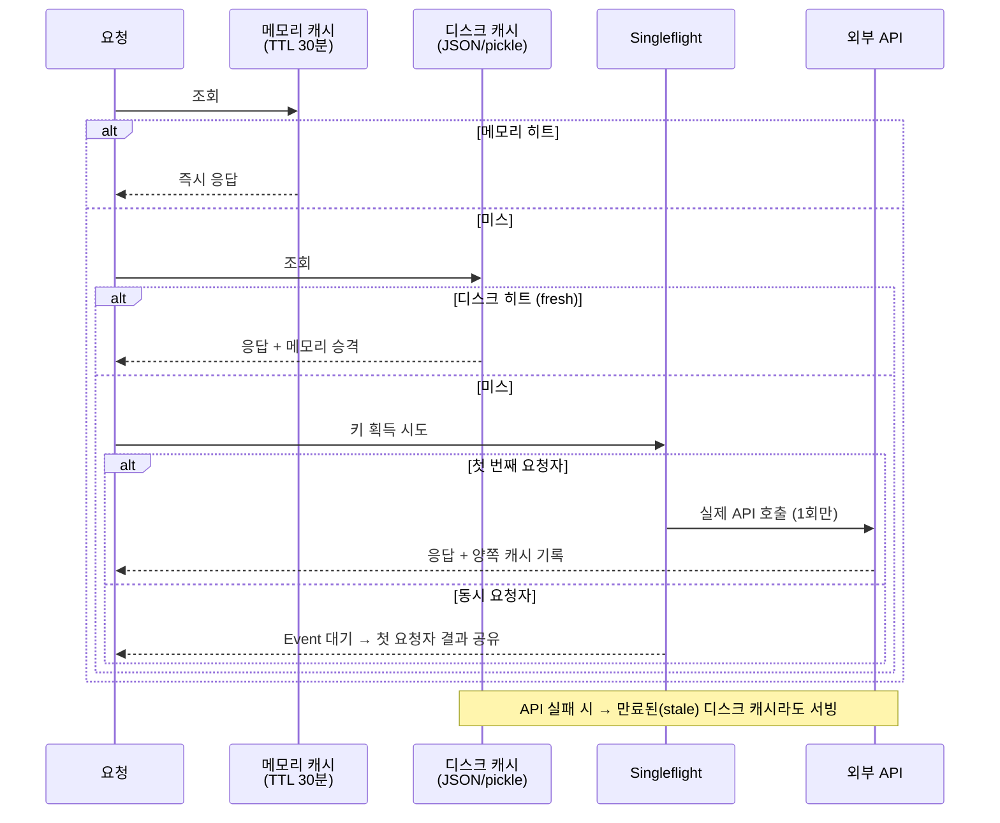

# Architecture Deep Dive

> AI 기반 주식 분석 플랫폼의 설계 문서입니다. 단순 CRUD 앱이 아니라, **무료/저비용 외부 API 위에서 프로덕션 수준의 안정성을 확보하는 것**과 **LLM을 "생성기"가 아닌 "검증기"로 쓰는 AI 파이프라인 설계**가 핵심 주제입니다.

## 목차

1. [시스템 개요](#1-시스템-개요)
2. [AI 파이프라인 — Gemini 기반 체크리스트 검증](#2-ai-파이프라인--gemini-기반-체크리스트-검증)
3. [50+ 지표 기술적 예측 엔진](#3-50-지표-기술적-예측-엔진)
4. [종합 랭킹 엔진](#4-종합-랭킹-엔진)
5. [매크로 서브시스템 — 규칙 기반 레짐 엔진](#5-매크로-서브시스템--규칙-기반-레짐-엔진)
6. [캐싱 아키텍처 — 3계층 + Singleflight](#6-캐싱-아키텍처--3계층--singleflight)
7. [Rate Limit 방어 계층](#7-rate-limit-방어-계층)
8. [백그라운드 워커 & 스케줄링](#8-백그라운드-워커--스케줄링)
9. [인증 & SPA 서빙](#9-인증--spa-서빙)
10. [프론트엔드 복원력 설계](#10-프론트엔드-복원력-설계)
11. [LLM Wiki — 문서를 데이터 소스로](#11-llm-wiki--문서를-데이터-소스로)
12. [설계 결정과 트레이드오프](#12-설계-결정과-트레이드오프)

---

## 1. 시스템 개요

FastAPI 단일 서버가 React SPA 서빙 + API + 백그라운드 데이터 파이프라인을 모두 담당하는 모놀리스 구조입니다. Render Starter 플랜 1대에서 8개 섹터 × 40여 종목의 분석을 실시간으로 제공합니다.



**데이터 흐름 원칙**: 브라우저는 절대 외부 API·Supabase에 직접 접근하지 않습니다. 모든 키는 서버 환경변수에만 존재하고, 모든 외부 호출은 캐시 계층과 rate limit 세마포어를 통과합니다.

---

## 2. AI 파이프라인 — Gemini 기반 체크리스트 검증

이 프로젝트에서 LLM을 쓰는 방식의 핵심 철학: **LLM에게 분석을 "생성"시키지 않고, 규칙 기반으로 만든 초안을 "검증·교정"시킵니다.** 환각(hallucination)을 구조적으로 차단하는 설계입니다.

### 5단계 파이프라인 (`GET /api/analysis/{ticker}/checklist-live`)



- **Phase 1–2**: 티커에서 기업 프로필(업종, 시총, 사업 요약)을 확정. 잘못된 종목 매핑을 초기에 차단
- **Phase 3–4**: `ThreadPoolExecutor`로 뉴스와 정량 데이터를 **병렬 수집** (각각 30초/60초 타임아웃)
- **Phase 5**: Gemini에게 아래 컨텍스트를 전부 주입하고 초안 체크리스트를 검증시킴

### Phase 5 프롬프트에 주입되는 컨텍스트

| 데이터 | 출처 |
|---|---|
| 기업 프로필 (업종·시총·이익률·매출성장률·사업요약) | yfinance + Finnhub + Naver |
| 애널리스트 컨센서스 (목표가·투자의견) | Naver 리서치 |
| 수급 데이터 (외국인·기관 5일 순매수) | Naver 모바일 API |
| 연간 재무제표, 경쟁사 목록 | yfinance |
| 검증된 뉴스 헤드라인 상위 10건 + 감성 | Google News + Naver 뉴스 |
| 애널리스트 리포트 최대 5건 | Naver 리서치 |
| **규칙 기반으로 생성된 초안 체크리스트** | 백엔드 자체 로직 |

LLM은 4가지 작업만 수행합니다: ① 체크리스트 항목 검증(keep/remove/adjust/add) ② 투자 논지 요약 ③ Top-3 리스크 ④ 뉴스-논지 정합성 판단. **응답은 JSON only.**

### 환각 방지 가드레일

LLM 출력을 그대로 신뢰하지 않고 코드 레벨에서 강제 검증합니다:

- **화이트리스트 검증**: AI가 추가한 항목의 메트릭은 `VALID_METRICS`에 존재해야만 반영
- **가중치 상한**: AI가 부여한 중요도는 88로 캡 (사람이 정의한 핵심 항목보다 높을 수 없음)
- **최소 항목 보장**: AI가 과도하게 삭제해도 최소 4개 항목 유지
- **결정론적 설정**: `temperature 0.2`, `maxOutputTokens 3000`, thinking budget 1024
- **Graceful degradation**: `GEMINI_API_KEY` 미설정 또는 API 실패 시 키워드 기반 규칙 결과로 자동 전환

### 비용·쿼터 제어

- AI 검증 결과는 **12시간 캐시** (`ai-verify:{ticker}`) — 같은 종목 재조회 시 LLM 호출 0회
- 서버 기동 시 워밍업 워커가 전 종목을 **3초 간격**으로 순차 사전계산 → 사용자는 항상 캐시 히트
- rate limit에 걸린 fallback 응답은 5분만 캐시 → 쿼터 회복 후 자동 재시도

### 점수 계산

각 체크리스트 항목은 실시간 데이터에 연결되어 0~100 연속 점수를 갖고, 중요도로 가중 평균합니다:

```
summary_score = Σ(item_score × importance) / Σ(importance)   → 0~100 클램프
```

기본 가중치는 지표 성격에 따라 차등: 매출성장률·마진 80, ROE·PER·PBR 65, 경쟁사 68, 환율 52, 원자재 48.

---

## 3. 50+ 지표 기술적 예측 엔진

`GET /api/analysis/{ticker}/prediction` — 1년치 일봉(최소 60일)에서 5개 카테고리 50개 이상의 지표를 계산해 -100~+100 종합 점수를 산출합니다.

| 카테고리 | 지표 |
|---|---|
| **추세** | SMA 5/10/20/50/100/200, EMA 6종, 골든/데드크로스(20-50, 50-200), DEMA, TEMA, Ichimoku(전환·기준), VWAP, Parabolic SAR |
| **모멘텀** | RSI 7/14/21, Stochastic %K/%D, Williams %R, MACD(크로스+히스토그램 추세), CCI, MFI, ROC 5/10/20, Ultimate Oscillator |
| **변동성** | Bollinger 위치/폭, ATR, Keltner Channel, Donchian Channel |
| **거래량** | OBV 추세, 거래량 SMA 비율, Chaikin Money Flow, A/D Line |
| **구조** | 52주 고저 위치, ADX(+DI/−DI), Fibonacci 되돌림, 선형회귀 기울기, Z-Score |

**집계 방식**:
1. 각 지표를 −1(강한 매도)~+1(강한 매수)로 정규화 — 예: RSI는 30/40/60/70 임계값으로 +1/+0.5/−0.5/−1
2. `overall_score = 평균 × 100` (−100~+100)
3. 판정: ≥40 강력매수 / ≥15 매수 / ≤−15 매도 / ≤−40 강력매도 / 그 외 중립
4. 신뢰도 = max(강세 지표 수, 약세 지표 수) / 전체 지표 수
5. **목표가 산출**: ATR × 점수 기반 — 1주 목표 `price + ATR×3×score`, 1개월 `×8`, 손절가 `price − 2×ATR`

단일 지표 과신을 피하고, 카테고리별 분해 점수를 UI에 노출해 "왜 이 판정인지"를 설명 가능하게 만든 설계입니다.

---

## 4. 종합 랭킹 엔진

`GET /api/analysis/top-ranked` — 전 종목(약 44개)을 `ThreadPoolExecutor(max_workers=6)`로 병렬 스코어링합니다.

```
종합점수 = 차트 점수 × 0.30 + AI 체크리스트 점수 × 0.45 + 펀더멘탈 점수 × 0.25
```

- **AI 체크리스트에 최대 가중치(45%)** — 정량 지표만으로 안 잡히는 사업 구조·뉴스 맥락이 반영된 점수이기 때문
- 체크리스트 캐시가 아직 없는 종목은 RSI·모멘텀·추세·거래량 기반 휴리스틱으로 fallback
- 점수는 5~98로 클램프 (극단값 방지), TTL 10분 캐시
- 워밍업 워커가 전 종목 체크리스트 계산을 마치면 랭킹 캐시를 무효화하고 재생성 → **상세 페이지 점수와 랭킹 점수가 항상 일치**

---

## 5. 매크로 서브시스템 — 규칙 기반 레짐 엔진

의도적으로 **LLM을 쓰지 않은** 영역입니다. 레짐 판정은 재현 가능하고 백테스트 가능해야 하므로, 명시적 임계값 기반 규칙으로 설계했습니다 (스펙: `wiki/macro/05-regime-scoring.md`).

### 원자재 레짐 분류 (`commodity_regime_history.py`)

22개 원자재/지표 티커 + 3개 계산 비율(금/구리 비율 등) = 25개 항목을 **5년 히스토리** 기반으로 추적:

- **지표**: 5년 백분위, 5년 고점/저점 대비 %, 30/60/252일 수익률, 변동성 레짐 z-score(60일 실현변동성 vs 5년 롤링 평균), 12개월 추세 기울기, 모멘텀 가속도, 3년 돌파/붕괴 플래그
- **6-state 분류** (우선순위 순):



- **상태 영속화**: `data/commodity_regime_state.json`에 항목별 현재 레짐, 진입일, 유지 일수를 저장 — 서버 재시작에도 "Crash → Rebound" 같은 상태 전이 판정이 유지됨
- **자동 리포트**: 일일 갱신에서 레짐 변화가 있을 때만 `Output/reports/commodity-regime-YYYY-MM-DD.md` 생성, 일요일에는 주간 요약 리포트 생성 (Obsidian 호환 frontmatter)

### 섹터 센티먼트 (`macro_sentiment.py`)

원자재 신호를 섹터별 정·역방향 룰에 매핑해 점수화:

- `score = 강세 신호 수 − 약세 신호 수` → 판정: ≥3 유망 / ≥1 관심 / ≤−1 주의 / ≤−3 부담
- **ETF 모멘텀은 점수에서 의도적으로 제외** — 섹터 ETF 가격은 "결과"이지 선행지표가 아니므로, 표시만 하고 판정엔 반영하지 않음
- 정부 통계·공시 등 실제 선행지표는 출처 URL과 함께 별도 표시

### 매크로 뉴스 스캐너 (`macro_news.py`)

이슈별 쿼리로 Google News RSS를 수집하고 긴급도를 점수화 (`키워드 매칭/4 + 36시간 감쇠 최신성/6`), 각 이슈를 수혜/피해 섹터에 방향·근거와 함께 매핑합니다.

---

## 6. 캐싱 아키텍처 — 3계층 + Singleflight

무료 데이터 소스(yfinance)의 rate limit이 이 시스템의 최대 제약입니다. 캐시는 성능 최적화가 아니라 **생존 전략**입니다.



- **메모리**: `_ANALYSIS_CACHE` dict, 기본 TTL 30분. 엔드포인트별 차등 — 뉴스 3분, 랭킹 10분, 예측 1시간, 체크리스트 2시간, AI 검증 12시간
- **디스크**: SHA 다이제스트 키의 JSON/pickle, Render persistent disk(`/var/data/stock-cache`). 배포·재시작에도 캐시 생존
- **Singleflight**: `threading.Event` 기반 — 인기 종목에 동시 요청 N개가 몰려도 외부 API 호출은 정확히 1회. 나머지는 Event를 기다렸다 결과를 공유
- **Stale-serving**: 외부 API가 죽거나 rate limit에 걸리면 만료된 디스크 캐시라도 반환 — "오래된 데이터 > 에러 화면"

---

## 7. Rate Limit 방어 계층

yfinance는 비공식 API라 공격적으로 호출하면 IP가 차단됩니다. 4중 방어를 둡니다:

1. **브라우저 위장**: `curl_cffi`의 `impersonate="chrome"` 세션을 yfinance에 전역 주입 — 브라우저 TLS 핑거프린트로 봇 차단 회피
2. **동시성 세마포어** (`runtime_controls.py`): yfinance 동시 2개, 일반 HTTP 동시 6개로 제한 (`BoundedSemaphore`)
3. **최소 호출 간격**: yfinance 호출 간 0.5초 강제 (전역 락으로 보장)
4. **순차 처리 원칙**: 워밍업·일일 갱신은 종목별 0.5~3초 간격 순차 처리 — 콜드부트 시 버스트로 차단당하는 것을 방지

모든 외부 호출은 `limit_yfinance()` / `limit_http()` 컨텍스트를 통과해야 하며, 우회 경로가 없습니다.

---

## 8. 백그라운드 워커 & 스케줄링

FastAPI `lifespan`에서 데몬 스레드 4개를 기동합니다:

| 워커 | 역할 |
|---|---|
| `_warmup_cache` | 기동 직후 섹터·원자재 등 **공유 캐시만** 워밍 (종목별 워밍업은 의도적으로 배제 — 콜드부트 rate limit 방지) |
| `_warmup_checklist_scores` | 30초 후 전 종목 Gemini 체크리스트를 3초 간격 사전계산 → 완료 시 랭킹 재생성 |
| `_keep_alive` | 10분마다 self-ping — Render 슬립 방지 |
| `_daily_refresh_worker` | **매일 KST 06:00** (한국 장 시작 전): 캐시 무효화 → 원자재·매크로 갱신 → 전 종목 순차 갱신 → 랭킹 재생성 → 레짐 히스토리 업데이트 + 리포트 생성 |

`POST /api/refresh-now`로 수동 트리거, `GET /api/refresh-status`로 마지막 갱신 상태(성공/실패 카운트, 레짐 변화 수) 조회가 가능합니다.

---

## 9. 인증 & SPA 서빙

### Pure ASGI AuthMiddleware

Starlette의 `BaseHTTPMiddleware`는 응답 스트리밍 블로킹과 오버헤드 문제가 있어, **raw ASGI 인터페이스로 직접 구현**했습니다:

- `GET/HEAD/OPTIONS` → 무조건 통과 (읽기는 공개)
- `POST/PUT/DELETE` on `/api/*` → `X-Auth-Nickname` 헤더를 URL 디코딩 후 허용 멤버 목록과 대조, 실패 시 403
- 로그인 검증·방문 기록 엔드포인트만 예외
- CORS 미들웨어 **뒤에** 등록 (Starlette는 미들웨어를 역순 적용하므로 CORS가 바깥을 감싸게 됨)

### SPA 서빙의 함정 처리

FastAPI가 `frontend/dist`를 직접 서빙하는데, 흔한 SPA catch-all 구현의 버그를 방지합니다:

- 존재하지 않는 **해시드 에셋**(`assets/index-abc123.js`) 요청 → `index.html`이 아닌 **404** 반환. (배포 직후 구버전 HTML이 신버전 JS를 요청하는 레이스에서 "HTML을 JS로 파싱" 에러를 원천 차단)
- `index.html`은 항상 `no-cache` 헤더로 서빙 → 브라우저가 최신 에셋 해시를 즉시 인지

---

## 10. 프론트엔드 복원력 설계

백엔드가 무료 인프라 위에 있으므로, 프론트엔드도 실패를 전제로 설계했습니다 (`src/api/client.ts`):

- **`dedupedGet`**: 동일 URL의 in-flight 요청을 Map으로 공유 — 컴포넌트 여러 개가 같은 데이터를 요청해도 네트워크 호출 1회
- **localStorage 응답 캐시 (TTL 6시간)**: API 실패 시 캐시된 응답으로 자동 fallback
- **자동 재시도**: 5xx·타임아웃·403(배포 레이스)에 대해 최대 2회, 1.5초 × 시도횟수 백오프
- **3단계 fallback** (랭킹): API → localStorage → 정적 섹터 데이터로 생성한 기본 랭킹 — 어떤 상황에도 빈 화면이 나오지 않음
- 인증 인터셉터가 `X-Auth-Nickname`을 자동 부착

---

## 11. LLM Wiki — 문서를 데이터 소스로

[Karpathy의 LLM Wiki 패턴](https://x.com/karpathy)을 적용해, 사람이 읽는 위키가 동시에 **백엔드의 데이터 소스**로 동작합니다:

```
raw/     # 불변 원본 (PDF, 리포트) — 수정 금지
wiki/    # AI가 컴파일한 위키 — index.md, log.md로 변경 추적
Output/  # 생성된 분석 리포트 (레짐 엔진이 자동 작성)
```

- `wiki/macro/04-value-chain.md`(밸류체인 문서)를 `value_chain_parser.py`가 파싱해 **API 응답으로 서빙** — mermaid 다이어그램, 티어별 기업, 히든 종목까지 구조화 추출
- `wiki/macro/01-commodities.md`의 원자재-종목 매핑을 매크로 피드가 참조
- `wiki/macro/05-regime-scoring.md`가 레짐 엔진의 스펙 문서 — 코드와 문서가 같은 임계값을 공유
- 레짐 엔진이 생성하는 일간/주간 리포트는 Obsidian frontmatter를 포함해 위키 생태계에 편입

즉, **"문서 → 파싱 → API" / "엔진 → 리포트 → 문서"의 양방향 파이프라인**으로, LLM 에이전트가 위키를 갱신하면 서비스 데이터가 함께 갱신됩니다.

---

## 12. 설계 결정과 트레이드오프

| 결정 | 이유 | 트레이드오프 |
|---|---|---|
| **LLM은 검증기, 생성기 아님** | 규칙 기반 초안 + LLM 교정 → 환각 차단, 출력 구조 보장 | LLM의 창의적 인사이트는 일부 포기 |
| **매크로 엔진은 LLM 미사용** | 레짐 판정은 재현·백테스트 가능해야 함. 임계값이 명시된 규칙이 신뢰성↑ | 새 시나리오는 룰 추가 필요 |
| **모놀리스 (서버 1대)** | 운영비 최소화, 배포 단순화. 트래픽 규모(소수 사용자)에 적정 | 수평 확장 시 메모리 캐시·상태 파일 재설계 필요 |
| **메모리 캐시 dict (Redis 아님)** | 외부 의존성 제거, 무료 티어 유지. 디스크 캐시가 재시작 갭을 커버 | uvicorn 워커 간 캐시 비공유 (디스크 캐시로 완화) |
| **Stale-serving 기본** | 주식 데이터 특성상 "30분 전 데이터"가 "에러"보다 항상 낫다 | 데이터 신선도 보장 약화 (UI에 갱신 시각 표시로 보완) |
| **Pure ASGI 미들웨어** | BaseHTTPMiddleware의 스트리밍 블로킹·오버헤드 회피 | Starlette 추상화 포기, 직접 scope 처리 |
| **인증을 mutation에만 적용** | 읽기 공개로 공유 편의성↑, 쓰기만 보호하면 데이터 무결성 충분 | 읽기 데이터는 비공개 아님 (민감 데이터 없음) |
| **AI 결과 12h 캐시 + 워밍업 사전계산** | Gemini 무료 쿼터 내 운영, 사용자 체감 지연 0 | 장중 뉴스 반영은 다음 워밍업까지 지연 |

---

## 부록: 주요 수치 요약

| 항목 | 값 |
|---|---|
| 분석 캐시 TTL | 30분 (뉴스 3분 / 랭킹 10분 / 예측 1시간 / AI 검증 12시간) |
| 프론트 localStorage 캐시 | 6시간 |
| yfinance 동시성 / 최소 간격 | 2 / 0.5초 |
| HTTP 동시성 | 6 |
| Gemini 모델 / 설정 | gemini-2.5-flash, temperature 0.2, thinking budget 1024 |
| 랭킹 가중치 | 차트 30% + AI 체크리스트 45% + 펀더멘탈 25% |
| 예측 판정 임계값 | ±15 매수/매도, ±40 강력매수/매도 |
| 레짐 추적 대상 | 원자재 22개 + 비율 3개, 5년 히스토리 |
| 일일 갱신 | KST 06:00 (한국 장 시작 전) |
