# Value Chain 페이지 — 27개 섹터 Tier 0~5

## 1. 페이지 철학

"엔비디아 어닝 발표 → 어느 한국 소부장이 수혜?" / "Tesla 인도 +20% → 어느 양극재?" / "BTS 컴백 → 어느 종목?" 이런 질문에 즉시 답하기 위함.

각 섹터를 Tier 0~5로 쪼개고, 한국 소부장이 가장 많이 숨어있는 **Tier 4**를 가장 깊게 다룬다.

## 2. Tier 정의

- **Tier 0**: 최종 수요 (Hyperscalers·OEM·정부·환자·소비자)
- **Tier 1**: 원청/브랜드사 (NVDA·Tesla·Boeing·LLY)
- **Tier 2**: 제조/조립 (TSMC·셀제조·CDMO·ODM)
- **Tier 3**: 장비/핵심 부품 (ASML·BWXT)
- **Tier 4**: **소재·화학·정밀부품 — 한국 소부장이 여기 多** ← 핵심 알파
- **Tier 5**: 원재료/광물 ([[01-commodities]] 매트릭스와 연동)

각 섹터마다: Mermaid 다이어그램 + Tier별 YAML 상세 + 한국 소부장 요약표 + 신호 전이 cheat sheet.

## 3. 27개 섹터 커버리지

- **Phase 1 Core 8개**: AI/반도체·로봇·SMR/원자력·사이버보안·우주항공/방산·생명공학·양자컴퓨팅·수소/에너지
- **한국 제조 주력 6개**: 이차전지·EV·EV소재·조선·철강·디스플레이
- **성장+소비 7개**: 인터넷플랫폼·게임·K콘텐츠·화장품·음식료·유통·의류
- **전통+알파 6개**: 건설·금융·통신·지주사·의료기기·호텔레저

총 **~360개 한국 종목** + **100여 개 미국 종목** 매핑.

---

# Part A — Phase 1 Core 8개 섹터 Value Chain

# Phase 3-1. Value Chain — 8개 섹터 Tier 0~5 + 한국 소부장 매핑

> 목적: 한국 투자자가 "엔비디아 어닝 발표 → 어느 한국 소부장 수혜?" 식 질문에 즉시 답하는 페이지.
> 각 섹터는 (1) Mermaid 가치사슬 다이어그램, (2) Tier별 YAML 상세, (3) 한국 소부장 요약표로 구성.

## Tier 정의 (공통)

| Tier | 정의 | 예시 |
|---|---|---|
| Tier 0 | 최종 수요 (자본 집행 주체) | Hyperscaler, OEM, 정부, 환자, 발전사업자 |
| Tier 1 | 원청·브랜드사 (설계·IP) | NVDA, Tesla, Boeing, LLY, Plug Power |
| Tier 2 | 제조·조립 (Tier 1 위탁) | TSMC, Samsung Foundry, CDMO, 체계조립 |
| Tier 3 | 장비·핵심 부품 | ASML, AMAT, BWXT, Harmonic Drive |
| Tier 4 | 소재·화학·정밀부품 ← **한국 소부장 多** | 솔브레인, 한솔케미칼, 동진쎄미켐 등 |
| Tier 5 | 원재료·광물 | 네온, 갈륨, 우라늄, 희토류, He-3 |

---

## 1. AI/반도체

### Mermaid 다이어그램

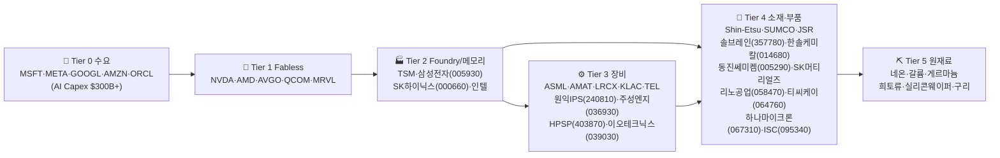

### Tier별 상세

```yaml
tier_0_demand:
  role: "AI Capex 집행, 데이터센터 GPU 수요 창출"
  players_us: [MSFT, META, GOOGL, AMZN, ORCL, AAPL]
  signal: "Hyperscaler Capex 가이던스 → 6~9개월 시차로 Tier 4 수혜"

tier_1_fabless:
  role: "AI 가속기·CPU·통신칩 설계 (IP 보유)"
  players_us:
    - {ticker: NVDA, role: "AI GPU (H100/B200/GB200)"}
    - {ticker: AMD, role: "MI300X·EPYC"}
    - {ticker: AVGO, role: "ASIC·네트워킹"}
    - {ticker: QCOM, role: "모바일 SoC"}
    - {ticker: MRVL, role: "DC 네트워킹·커스텀 ASIC"}

tier_2_manufacturing:
  role: "Foundry (로직) + 메모리 (DRAM/HBM/NAND)"
  players_kr:
    - {name: "삼성전자", ticker: "005930", role: "Foundry 2nm·HBM3E·DRAM"}
    - {name: "SK하이닉스", ticker: "000660", role: "HBM3E 1위·DRAM·NAND"}
  players_us: [TSM, INTC, MU]
  cost_drivers: [전력, 웨이퍼, 가스]

tier_3_equipment:
  role: "전공정/후공정 장비 (EUV·ALD·Etch·검사)"
  players_kr:
    - {name: "원익IPS", ticker: "240810", role: "ALD·CVD 장비 (HBM TSV)"}
    - {name: "주성엔지니어링", ticker: "036930", role: "ALD·DRAM 장비"}
    - {name: "HPSP", ticker: "403870", role: "고압 수소 어닐링 (독점)"}
    - {name: "이오테크닉스", ticker: "039030", role: "레이저 마커·어닐링"}
    - {name: "파크시스템스", ticker: "140860", role: "원자현미경 (검사)"}
    - {name: "피에스케이", ticker: "319660", role: "PR Strip·드라이 클리너"}
  players_us: [ASML, AMAT, LRCX, KLAC, TEL]
  cost_drivers: [구리, 정밀가공, 광학부품]

tier_4_materials:
  role: "포토레지스트·CMP 슬러리·전구체·프로브카드·테스트소켓"
  players_kr:
    - {name: "솔브레인", ticker: "357780", role: "고순도 인산·식각액 (HBM 必)"}
    - {name: "한솔케미칼", ticker: "014680", role: "과산화수소·전구체 (HBM·EUV)"}
    - {name: "동진쎄미켐", ticker: "005290", role: "포토레지스트 국산화"}
    - {name: "SK스페셜티", ticker: "비상장", role: "특수가스 (NF3·WF6)"}
    - {name: "리노공업", ticker: "058470", role: "테스트핀·소켓 (Apple·NVDA 공급)"}
    - {name: "ISC", ticker: "095340", role: "테스트소켓 (HBM·AP)"}
    - {name: "티씨케이", ticker: "064760", role: "SiC 부품 (식각챔버)"}
    - {name: "하나마이크론", ticker: "067310", role: "후공정 패키징"}
    - {name: "디엔에프", ticker: "092070", role: "전구체 (HCDS·하이K)"}
    - {name: "원익QnC", ticker: "074600", role: "쿼츠웨어·세정"}
  players_jp: [Shin-Etsu, SUMCO, JSR, TOK]
  cost_drivers: [네온, 불소, 인산, SiC]
  signal_map:
    - "NVDA HBM 수요 발표 → 솔브레인·한솔케미칼 3~6개월 시차 수혜 (HBM TSV 식각액)"
    - "TSMC Capex 상향 → 원익IPS·HPSP 6~9개월 시차 수혜 (장비 발주)"
    - "Apple 신제품 출시 → 리노공업 1~3개월 시차 (테스트핀 선행)"
    - "EUV 출하 증가 → 동진쎄미켐 EUV PR 매출 증가 (12개월+)"

tier_5_raw:
  role: "광물·가스 원재료"
  materials:
    - {name: "네온(Ne)", source: "우크라이나·중국", use: "DUV/EUV 노광"}
    - {name: "갈륨(Ga)", source: "중국 95%", use: "GaN 전력반도체"}
    - {name: "게르마늄(Ge)", source: "중국 60%", use: "광통신·우주센서"}
    - {name: "희토류(Nd·Dy)", source: "중국 70%", use: "정밀모터·MRI"}
    - {name: "실리콘웨이퍼", source: "Shin-Etsu·SUMCO", use: "기판"}
  link: "[[01-commodities#네온]] [[01-commodities#갈륨]]"
```

### 한국 소부장 요약표

| 티어 | 수혜 1순위 (원청) | 한국 알파 | 위험 신호 |
|---|---|---|---|
| Tier 2 | TSM·NVDA | 삼성전자(005930)·SK하이닉스(000660) | 가동률 <80%, HBM ASP 하락 |
| Tier 3 | ASML·AMAT | 원익IPS(240810)·주성엔지(036930)·HPSP(403870) | 삼성·SK 장비 발주 지연 |
| Tier 4-식각 | TSM HBM | **솔브레인(357780)·한솔케미칼(014680)** | HBM 수율 이슈, NVDA 가이던스 컷 |
| Tier 4-포토 | EUV 도입 | 동진쎄미켐(005290) | EUV PR 일본 점유율 회복 |
| Tier 4-테스트 | Apple·NVDA | **리노공업(058470)·ISC(095340)** | 신제품 사이클 지연 |
| Tier 4-부품 | 식각챔버 | 티씨케이(064760)·원익QnC(074600) | SiC 가격 급등 |

---

## 2. 로봇

### Mermaid 다이어그램

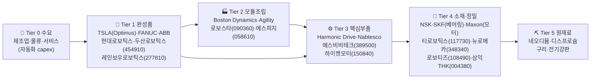

### Tier별 상세

```yaml
tier_0_demand:
  role: "휴머노이드·협동로봇·물류로봇 도입 주체"
  sectors: [자동차, 물류, 반도체fab, 전자상거래, 서비스]
  signal: "TSLA Optimus 양산 시점 → 감속기·모터 수요 폭증"

tier_1_brand:
  role: "휴머노이드·산업로봇 완성품"
  players_us: [TSLA(Optimus), Symbotic]
  players_kr:
    - {name: "두산로보틱스", ticker: "454910", role: "협동로봇 글로벌 4위"}
    - {name: "레인보우로보틱스", ticker: "277810", role: "휴머노이드 (삼성 인수)"}
    - {name: "현대로보틱스", ticker: "비상장", role: "산업로봇 (현대그룹)"}
  players_jp: [FANUC, Yaskawa]
  players_eu: [ABB, KUKA]

tier_2_assembly:
  role: "모듈·관절 조립"
  players_kr:
    - {name: "로보스타", ticker: "090360", role: "산업로봇 (LG 자회사)"}
    - {name: "에스피지", ticker: "058610", role: "정밀감속기·기어드모터"}
    - {name: "유진로봇", ticker: "056080", role: "AGV·물류로봇"}

tier_3_components:
  role: "감속기(하모닉·RV)·서보모터·컨트롤러"
  players_kr:
    - {name: "에스비비테크", ticker: "389500", role: "하모닉드라이브 국산화 (희소!)"}
    - {name: "하이젠모터", ticker: "150840", role: "BLDC 모터·정밀모터"}
    - {name: "삼익THK", ticker: "004380", role: "LM가이드·볼스크류"}
  players_jp:
    - {company: "Harmonic Drive Systems", role: "감속기 글로벌 1위 (휴머노이드 必)"}
    - {company: "Nabtesco", role: "RV 감속기"}
    - {company: "Maxon", role: "정밀 DC 모터"}
  cost_drivers: [희토류 자석, 베어링, 정밀가공]

tier_4_materials:
  role: "베어링·정밀부품·센서·자석"
  players_kr:
    - {name: "뉴로메카", ticker: "348340", role: "협동로봇 컨트롤러·SW"}
    - {name: "로보티즈", ticker: "108490", role: "다이나믹셀 모터"}
    - {name: "티로보틱스", ticker: "117730", role: "진공로봇 (반도체)"}
    - {name: "성우하이텍", ticker: "015750", role: "로봇 프레임·차체"}
  players_global:
    - {company: "NSK·SKF·Schaeffler", role: "정밀베어링"}
    - {company: "Hitachi Metals", role: "네오디뮴 자석"}
  cost_drivers: [네오디뮴, 디스프로슘, 구리, 전기강판]
  signal_map:
    - "TSLA Optimus 양산 ramp → Harmonic Drive 부족 → 에스비비테크 6~12개월 시차 알파 (국산화 수혜)"
    - "삼성 휴머노이드 발표 → 레인보우로보틱스 즉시 + 에스피지·하이젠모터 3~6개월"
    - "희토류 가격 30%↑ → 자석 부품주 마진 압박 (모든 Tier 4 위협)"

tier_5_raw:
  role: "영구자석·구조재 원재료"
  materials:
    - {name: "네오디뮴(Nd)", source: "중국 80%", use: "NdFeB 영구자석"}
    - {name: "디스프로슘(Dy)", source: "중국 90%", use: "고온 자석"}
    - {name: "구리", use: "권선·배선"}
    - {name: "전기강판", use: "모터 코어"}
  link: "[[01-commodities#희토류]]"
```

### 한국 소부장 요약표

| 티어 | 수혜 1순위 (원청) | 한국 알파 | 위험 신호 |
|---|---|---|---|
| Tier 1 | TSLA Optimus | 두산로보틱스(454910)·레인보우(277810) | 양산 일정 지연 |
| Tier 3 | Harmonic Drive 부족 | **에스비비테크(389500)** ← 핵심 hidden | 일본 증설 가속 |
| Tier 3 | 정밀모터 | 하이젠모터(150840)·로보티즈(108490) | 희토류 가격 급등 |
| Tier 4 | 베어링/LM | 삼익THK(004380)·에스피지(058610) | 자동차 capex 둔화 |
| Tier 5 | 희토류 | 영향 全 섹터 | 중국 수출 통제 |

---

## 3. SMR/원자력

### Mermaid 다이어그램

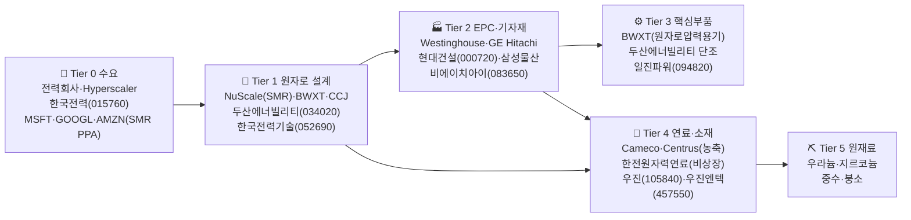

### Tier별 상세

```yaml
tier_0_demand:
  role: "전력 수요자 — Hyperscaler가 SMR 신규 수요 창출"
  players_us:
    - {ticker: MSFT, role: "Three Mile Island 재가동 PPA (Constellation)"}
    - {ticker: GOOGL, role: "Kairos Power SMR 7기 PPA"}
    - {ticker: AMZN, role: "X-energy SMR 투자"}
  players_kr:
    - {name: "한국전력", ticker: "015760", role: "신한울 3·4 발주"}
  signal: "AI 데이터센터 전력난 → SMR PPA 체결 → 12~36개월 시차로 기자재 수혜"

tier_1_design:
  role: "원자로 설계·라이선스"
  players_us:
    - {ticker: SMR, role: "NuScale (NRC 인증 SMR 1호)"}
    - {ticker: BWXT, role: "BWRX-300·해군 원자로"}
    - {ticker: LEU, role: "Centrus (HALEU 농축)"}
  players_kr:
    - {name: "두산에너빌리티", ticker: "034020", role: "NuScale·X-energy 기자재"}
    - {name: "한국전력기술", ticker: "052690", role: "원자로 설계"}
  players_jp_eu: [GE Hitachi BWRX-300, Rolls-Royce SMR, EDF Nuward]

tier_2_epc:
  role: "건설·EPC·대형 단조"
  players_kr:
    - {name: "현대건설", ticker: "000720", role: "원전 EPC 1위 (UAE·신한울)"}
    - {name: "삼성물산", ticker: "028260", role: "원전 EPC"}
    - {name: "비에이치아이", ticker: "083650", role: "복수기·열교환기"}
    - {name: "보성파워텍", ticker: "006910", role: "원전 케이블"}

tier_3_core_components:
  role: "원자로 압력용기·증기발생기·펌프"
  players_kr:
    - {name: "두산에너빌리티", ticker: "034020", role: "RPV 단조 (글로벌 4社 중 1)"}
    - {name: "일진파워", ticker: "094820", role: "원전 정비·터빈 부품"}
    - {name: "우진", ticker: "105840", role: "계측제어 (RVLMS)"}
  players_us: [BWXT(해군·SMR RPV), Curtiss-Wright]
  cost_drivers: [특수강, 단조, 니켈]

tier_4_fuel:
  role: "농축 우라늄·연료봉·계측"
  players_kr:
    - {name: "한전원자력연료", ticker: "비상장", role: "PWR 연료봉"}
    - {name: "우진엔텍", ticker: "457550", role: "원전 정비"}
    - {name: "오르비텍", ticker: "046120", role: "방사능 계측"}
  players_us:
    - {ticker: CCJ, role: "Cameco — 우라늄 채굴 (캐나다·카자흐)"}
    - {ticker: LEU, role: "Centrus — HALEU(SMR용 19.75% 농축)"}
    - {ticker: UEC, role: "Uranium Energy"}
  cost_drivers: [U3O8, SWU, 지르코늄]
  signal_map:
    - "MSFT/GOOGL SMR PPA → 두산에너빌리티 단조 발주 12~24개월 시차"
    - "HALEU 부족 → LEU(Centrus) 즉시 + 한전원자력연료 (장기)"
    - "우라늄 spot 가격 급등 → CCJ 분기 실적 직결, 한국 발전사 원가 부담"

tier_5_raw:
  role: "광물 원재료"
  materials:
    - {name: "우라늄(U3O8)", source: "카자흐스탄·캐나다·호주", use: "연료"}
    - {name: "지르코늄", source: "호주·남아공", use: "연료봉 피복"}
    - {name: "중수(D2O)", source: "캐나다·인도", use: "감속재"}
  link: "[[01-commodities#우라늄]]"
```

### 한국 소부장 요약표

| 티어 | 수혜 1순위 (원청) | 한국 알파 | 위험 신호 |
|---|---|---|---|
| Tier 1 | NuScale·BWXT | **두산에너빌리티(034020)** ← 단조 글로벌 4社 | NRC 인증 지연 |
| Tier 1 | KEPCO 설계 | 한국전력기술(052690) | 신규 수출 무산 |
| Tier 2 | 신한울·UAE | 현대건설(000720)·비에이치아이(083650) | EPC 마진 압박 |
| Tier 3 | RPV 발주 | 두산에너빌리티·일진파워(094820) | 단조 가동률 |
| Tier 4 | 정비 | 우진엔텍(457550)·우진(105840) | 원전 정비 단가 |
| Tier 5 | 우라늄 | CCJ·UEC (US) | 카자흐 공급 차질 |

---

## 4. 사이버보안

### Mermaid 다이어그램

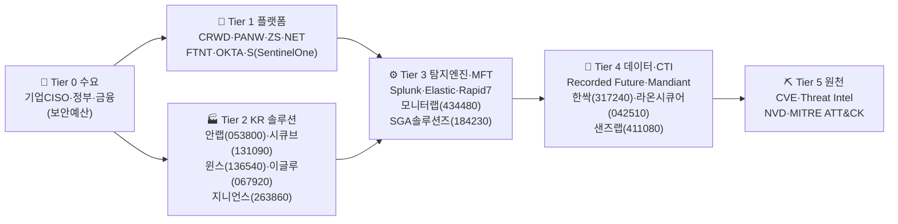

### Tier별 상세

```yaml
tier_0_demand:
  role: "보안 예산 집행 — 규제·해킹 사고 후 급증"
  drivers: [GDPR, 개인정보보호법, K-ISMS, 망분리, Zero Trust 의무화]
  signal: "대형 해킹 사고 → 동종업계 보안 capex 6~12개월 급증"

tier_1_platform:
  role: "글로벌 보안 플랫폼 (XDR·SASE·SIEM·IAM)"
  players_us:
    - {ticker: CRWD, role: "Endpoint·XDR (Falcon)"}
    - {ticker: PANW, role: "Firewall·SASE·Cortex"}
    - {ticker: ZS, role: "Zero Trust·SASE"}
    - {ticker: NET, role: "Cloudflare — Edge·DDoS"}
    - {ticker: FTNT, role: "Fortinet — Firewall"}
    - {ticker: OKTA, role: "IAM"}
    - {ticker: S, role: "SentinelOne"}
  cost_drivers: [클라우드 인프라, AI/ML 엔지니어]

tier_2_kr_solutions:
  role: "한국 시장 특화 (망분리·국정원 인증·CC인증)"
  players_kr:
    - {name: "안랩", ticker: "053800", role: "백신·EDR (V3) — 정부·금융 1위"}
    - {name: "시큐브", ticker: "131090", role: "DB보안·접근제어"}
    - {name: "윈스", ticker: "136540", role: "IPS·DDoS (통신사 공급)"}
    - {name: "이글루코퍼레이션", ticker: "067920", role: "SIEM·통합관제"}
    - {name: "지니언스", ticker: "263860", role: "NAC·EDR"}
    - {name: "파이오링크", ticker: "170790", role: "ADC·웹방화벽"}

tier_3_detection:
  role: "탐지엔진·로그분석·SOAR"
  players_us: [Splunk(CSCO), Elastic(ESTC), Rapid7(RPD), Datadog(DDOG)]
  players_kr:
    - {name: "모니터랩", ticker: "434480", role: "SaaS WAF·SECaaS"}
    - {name: "SGA솔루션즈", ticker: "184230", role: "OS보안·EDR"}
    - {name: "한국정보인증", ticker: "053300", role: "PKI·전자서명"}

tier_4_data:
  role: "위협 인텔리전스·CTI·MFT (관리형 파일전송)"
  players_us:
    - {company: "Recorded Future", role: "CTI 1위"}
    - {company: "Mandiant(GOOGL)", role: "포렌식·CTI"}
    - {company: "Progress(MFT)", role: "MOVEit"}
  players_kr:
    - {name: "한싹", ticker: "317240", role: "망연계·CDR"}
    - {name: "라온시큐어", ticker: "042510", role: "FIDO·모바일 인증"}
    - {name: "샌즈랩", ticker: "411080", role: "악성코드 분석·CTI"}
  cost_drivers: [데이터셋, ML 모델 학습 비용]
  signal_map:
    - "대형 해킹 사고 발생 → CRWD·PANW 즉시 + 안랩·지니언스 1~3개월 시차"
    - "정부 망분리 의무화 강화 → 한싹·시큐브 다음 분기 매출 점프"
    - "AI 보안 화두 (Prompt Injection) → 샌즈랩·모니터랩 신규 SKU"
    - "CRWD 어닝 ARR 가이던스 → 한국 EDR 시장 선행지표"

tier_5_raw:
  role: "위협 정보 원천"
  sources:
    - {name: "NVD/CVE", source: "NIST"}
    - {name: "MITRE ATT&CK", source: "MITRE"}
    - {name: "Dark Web feed", source: "각 CTI사 자체"}
```

### 한국 소부장 요약표

| 티어 | 수혜 1순위 (원청) | 한국 알파 | 위험 신호 |
|---|---|---|---|
| Tier 1 | 글로벌 capex | CRWD·PANW·ZS (US) | NRR <115% |
| Tier 2 | 정부·금융 발주 | **안랩(053800)·지니언스(263860)** | 공공 예산 삭감 |
| Tier 2 | 망분리 | 한싹(317240)·시큐브(131090) | 정책 완화 |
| Tier 3 | 통신사 IPS | 윈스(136540)·이글루(067920) | 통신사 capex 둔화 |
| Tier 4 | FIDO·인증 | 라온시큐어(042510) | 카카오·네이버 자체개발 |

---

## 5. 우주항공/방산

### Mermaid 다이어그램

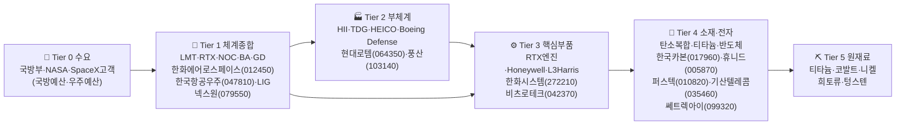

### Tier별 상세

```yaml
tier_0_demand:
  role: "국방예산·우주예산"
  drivers:
    - "한국 국방예산 60조+ (2026 기준 +5%)"
    - "美 NDAA $850B+, K-방산 폴란드·UAE·이집트 수출"
    - "SpaceX·Blue Origin 발사 capex"
  signal: "대형 수출계약 (폴란드 K2·K9, UAE 천궁) → 12~24개월 매출 인식"

tier_1_systems:
  role: "체계종합 (전투기·전차·미사일·잠수함·위성)"
  players_kr:
    - {name: "한화에어로스페이스", ticker: "012450", role: "K9 자주포·누리호 엔진·위성체"}
    - {name: "한국항공우주(KAI)", ticker: "047810", role: "FA-50·KF-21·헬기"}
    - {name: "LIG넥스원", ticker: "079550", role: "천궁·신궁·미사일"}
    - {name: "현대로템", ticker: "064350", role: "K2 전차·차륜장갑차"}
  players_us: [LMT, RTX, NOC, BA, GD, LDOS]

tier_2_subsystems:
  role: "부체계·정밀무장·탄약"
  players_kr:
    - {name: "풍산", ticker: "103140", role: "탄약·신관 (155mm)"}
    - {name: "SNT다이내믹스", ticker: "003570", role: "변속기·파워팩"}
    - {name: "현대위아", ticker: "011210", role: "차량포·공작기계"}
  players_us: [HII(조선), TDG(부품), HEICO]

tier_3_core_parts:
  role: "엔진·레이더·EO/IR·통신"
  players_kr:
    - {name: "한화시스템", ticker: "272210", role: "AESA 레이더·위성 통신"}
    - {name: "비츠로테크", ticker: "042370", role: "방산 전자·핵융합 부품"}
    - {name: "코위버", ticker: "056360", role: "광전송"}
  players_us: [RTX 엔진, Honeywell, L3Harris]
  cost_drivers: [티타늄, 갈륨(GaN AESA), 정밀가공]

tier_4_materials:
  role: "탄소복합재·티타늄·전자장비"
  players_kr:
    - {name: "한국카본", ticker: "017960", role: "탄소복합재 (UAM·드론)"}
    - {name: "휴니드테크놀러지스", ticker: "005870", role: "통신장비·전술네트워크"}
    - {name: "퍼스텍", ticker: "010820", role: "유도무기 부품·항법"}
    - {name: "기산텔레콤", ticker: "035460", role: "위성·국방통신"}
    - {name: "쎄트렉아이", ticker: "099320", role: "소형위성·지구관측 (한화 자회사)"}
    - {name: "인텔리안테크", ticker: "189300", role: "위성안테나 (Starlink·OneWeb)"}
    - {name: "AP위성", ticker: "211270", role: "위성통신단말"}
  cost_drivers: [티타늄, 코발트, 갈륨, 탄소섬유]
  signal_map:
    - "폴란드 K2 추가계약 → 현대로템 + 풍산(탄약) + SNT다이내믹스(변속기) 12~24개월"
    - "KF-21 양산 결정 → KAI + 한화시스템(AESA) 18~36개월"
    - "Starlink/OneWeb LEO 위성 추가 발사 → 인텔리안테크 즉시 수혜"
    - "美 NDAA 통과 → LMT·RTX·NOC 분기 실적, K-방산 미국 진출 키"

tier_5_raw:
  role: "전략 광물"
  materials:
    - {name: "티타늄", source: "러시아·중국", use: "기체·엔진"}
    - {name: "코발트", source: "DRC 70%", use: "초내열합금"}
    - {name: "갈륨", source: "중국 95%", use: "GaN AESA"}
    - {name: "텅스텐", source: "중국 80%", use: "관통탄"}
    - {name: "탄소섬유", source: "Toray 일본", use: "복합재"}
```

### 한국 소부장 요약표

| 티어 | 수혜 1순위 (원청) | 한국 알파 | 위험 신호 |
|---|---|---|---|
| Tier 1 | 폴란드·UAE 수출 | 한화에어로(012450)·KAI(047810)·LIG넥스원(079550) | 환율·수출 무산 |
| Tier 2 | 우크라 탄약 | **풍산(103140)** ← 155mm 핵심 | 휴전 시 탄약 수요 급감 |
| Tier 3 | KF-21 AESA | 한화시스템(272210) | 갈륨 수출 통제 |
| Tier 4 | LEO 위성 | **인텔리안테크(189300)** ← Starlink hidden | OneWeb 자금난 |
| Tier 4 | 소형위성 | 쎄트렉아이(099320) | 한화 통합 시너지 |
| Tier 5 | 티타늄 | 러시아 의존 — 대체불가 | 제재 강화 |

---

## 6. 생명공학

### Mermaid 다이어그램

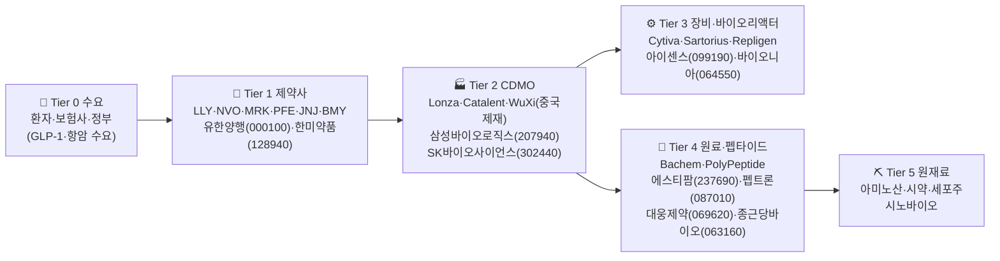

### Tier별 상세

```yaml
tier_0_demand:
  role: "환자·보험사·정부 — 약가 결정자"
  drivers:
    - "비만 인구 (GLP-1 폭발적 수요 — Wegovy/Zepbound)"
    - "고령화 (항암·치매·심혈관)"
    - "美 IRA 약가협상 (역풍)"
    - "中 BIOSECURE Act → WuXi 제재 → CDMO 반사이익"

tier_1_pharma:
  role: "신약 개발·판매 (특허 보유)"
  players_us:
    - {ticker: LLY, role: "Mounjaro·Zepbound·Donanemab"}
    - {ticker: NVO, role: "Ozempic·Wegovy"}
    - {ticker: MRK, role: "Keytruda"}
    - {ticker: PFE, role: "백신·항암"}
    - {ticker: JNJ, role: "다각화"}
    - {ticker: BMY, role: "Eliquis·항암"}
    - {ticker: REGN, role: "Eylea·Dupixent"}
  players_kr:
    - {name: "유한양행", ticker: "000100", role: "렉라자 (J&J 라이선싱)"}
    - {name: "한미약품", ticker: "128940", role: "롤론티스·GLP-1 파이프"}
    - {name: "셀트리온", ticker: "068270", role: "바이오시밀러 1위"}
    - {name: "삼성바이오에피스", ticker: "비상장", role: "시밀러"}

tier_2_cdmo:
  role: "위탁개발·생산 — Tier 1 capex 대체"
  players_kr:
    - {name: "삼성바이오로직스", ticker: "207940", role: "CDMO 글로벌 1위 (캐파)"}
    - {name: "SK바이오사이언스", ticker: "302440", role: "백신 CDMO"}
    - {name: "프레스티지바이오로직스", ticker: "334970", role: "시밀러 CDMO"}
  players_global: [Lonza(스위스), Catalent(US), WuXi Bio(중국 — 제재)]
  cost_drivers: [바이오리액터 가동률, 시약, 인건비]

tier_3_equipment:
  role: "바이오리액터·정제·필터·분석장비"
  players_us_eu: [Cytiva(Danaher), Sartorius, Repligen, Thermo Fisher, MilliporeSigma]
  players_kr:
    - {name: "아이센스", ticker: "099190", role: "CGM·진단"}
    - {name: "바이오니아", ticker: "064550", role: "PCR·분자진단"}
    - {name: "씨젠", ticker: "096530", role: "분자진단 키트"}

tier_4_api_peptide:
  role: "원료의약품·펩타이드·올리고 (GLP-1 핵심!)"
  players_kr:
    - {name: "에스티팜", ticker: "237690", role: "**올리고뉴클레오타이드 글로벌 2위** (Novartis·Roche 공급)"}
    - {name: "펩트론", ticker: "087010", role: "GLP-1 서방형 (LLY 협업)"}
    - {name: "대웅제약", ticker: "069620", role: "보툴리눔·API"}
    - {name: "종근당바이오", ticker: "063160", role: "원료의약품"}
    - {name: "유한화학", ticker: "비상장", role: "API"}
    - {name: "삼양홀딩스", ticker: "000070", role: "약물전달·생분해성소재"}
  players_global: [Bachem(스위스), PolyPeptide(스위스)]
  cost_drivers: [아미노산, 시약, 정제수율]
  signal_map:
    - "LLY/NVO GLP-1 capex 부족 → 펩트론·에스티팜 12~18개월 시차 (장기 알파)"
    - "BIOSECURE Act WuXi 제재 → 삼성바이오로직스·SK바이오사이언스 즉시 수주 이전"
    - "Keytruda 특허만료(2028) → 셀트리온·삼성에피스 시밀러 2027~ 수혜"
    - "Donanemab 매출 ramp → 셀트리온CMO 가능성 (장기)"

tier_5_raw:
  role: "원재료·시약"
  materials:
    - {name: "아미노산", source: "Ajinomoto·Evonik"}
    - {name: "올리고 단량체", source: "GE·HONGENE"}
    - {name: "세포주", source: "ATCC·자체"}
    - {name: "효소·시약", source: "Thermo·Sigma"}
```

### 한국 소부장 요약표

| 티어 | 수혜 1순위 (원청) | 한국 알파 | 위험 신호 |
|---|---|---|---|
| Tier 1 | GLP-1 시장 | LLY·NVO (US) — 한국 직접 수혜 미약 | FDA 약가협상 |
| Tier 2 | WuXi 제재 | **삼성바이오로직스(207940)** ← 최대 수혜 | BIOSECURE 무산 |
| Tier 4 | GLP-1 capex 부족 | **펩트론(087010)·에스티팜(237690)** ← hidden alpha | LLY 자체생산 확대 |
| Tier 4 | 시밀러 | 셀트리온(068270)·삼성에피스 | Keytruda 매출 둔화 |
| Tier 3 | CGM | 아이센스(099190) | DexCom·Abbott 점유율 |

---

## 7. 양자컴퓨팅

### Mermaid 다이어그램

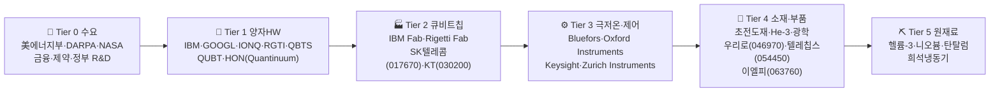

### Tier별 상세

```yaml
tier_0_demand:
  role: "초기 수요 — 정부·연구·금융 (상용화 전 단계)"
  drivers:
    - "美 National Quantum Initiative ($1.2B+)"
    - "EU Quantum Flagship (€1B)"
    - "한국 양자전략 (2030년까지 1조원)"
    - "JPM·Goldman 금융 시뮬레이션"

tier_1_hardware:
  role: "양자컴퓨터 시스템·클라우드"
  players_us:
    - {ticker: IBM, role: "Heron 156q·Condor 1121q (초전도)"}
    - {ticker: GOOGL, role: "Willow 105q (오류정정 첫 성과)"}
    - {ticker: IONQ, role: "이온트랩"}
    - {ticker: RGTI, role: "Rigetti — 초전도"}
    - {ticker: QBTS, role: "D-Wave — 어닐링"}
    - {ticker: QUBT, role: "광자 양자"}
    - {ticker: HON, role: "Quantinuum (이온트랩)"}
  signal: "오류정정(QEC) 마일스톤 달성 → 전체 섹터 리레이팅"

tier_2_qubit_chip:
  role: "큐비트 제조 — 대부분 인하우스"
  players_global: [IBM Fab, Rigetti Fab, Atom Computing]
  players_kr:
    - {name: "SK텔레콤", ticker: "017670", role: "QKD·양자암호 (IDQ 인수)"}
    - {name: "KT", ticker: "030200", role: "양자암호 통신"}
  note: "한국은 HW 제조 약점, QKD 통신 강점"

tier_3_cryo_control:
  role: "희석냉동기·임펄스 제어·극저온 케이블"
  players_global:
    - {company: "Bluefors", country: "핀란드", role: "희석냉동기 글로벌 1위"}
    - {company: "Oxford Instruments", country: "영국", role: "극저온 시스템"}
    - {company: "Keysight Technologies", ticker: "KEYS", role: "고주파 측정"}
    - {company: "Zurich Instruments", role: "임펄스 제어"}
  cost_drivers: [헬륨-3, 정밀가공, 초전도 케이블]

tier_4_materials:
  role: "초전도 박막·광학·동축케이블"
  players_kr:
    - {name: "우리로", ticker: "046970", role: "광통신·QKD 부품"}
    - {name: "텔레칩스", ticker: "054450", role: "ASIC 설계 (간접)"}
    - {name: "이엘피", ticker: "063760", role: "FPD·반도체 부품 (간접)"}
    - {name: "유니퀘스트", ticker: "077500", role: "반도체 IP (간접)"}
  note: "양자 직접 노출 한국주 매우 적음 — 대부분 통신·반도체 간접"
  cost_drivers: [니오븀, 탄탈럼, 헬륨-3]
  signal_map:
    - "GOOGL Willow급 오류정정 발표 → 全 양자 종목 sector rally (1~3개월)"
    - "헬륨-3 가격 급등 → Bluefors 공급 차질 → 양자 capex 지연"
    - "한국 양자 R&D 예산 발표 → SKT·KT 단기 모멘텀"

tier_5_raw:
  role: "초희귀 원재료"
  materials:
    - {name: "헬륨-3 (He-3)", source: "美 핵무기 비축분·달 채굴 가능성", use: "희석냉동기"}
    - {name: "니오븀(Nb)", source: "브라질 90%", use: "초전도 큐비트"}
    - {name: "탄탈럼(Ta)", source: "DRC·호주", use: "큐비트 박막"}
  link: "[[01-commodities#헬륨]]"
```

### 한국 소부장 요약표

| 티어 | 수혜 1순위 (원청) | 한국 알파 | 위험 신호 |
|---|---|---|---|
| Tier 1 | 정부 R&D | IBM·GOOGL·IONQ (US) | QEC 진전 부재 |
| Tier 2 | QKD 시장 | SKT(017670)·KT(030200) | 양자암호 표준화 지연 |
| Tier 4 | 광통신 | 우리로(046970) | 양자 직접 노출 작음 |
| Tier 5 | He-3 | 글로벌 부족 | 채굴 대안 없음 |
| 주의 | — | 한국 직접 알파 매우 제한적 — 테마성 변동 큼 | — |

---

## 8. 수소/에너지

### Mermaid 다이어그램

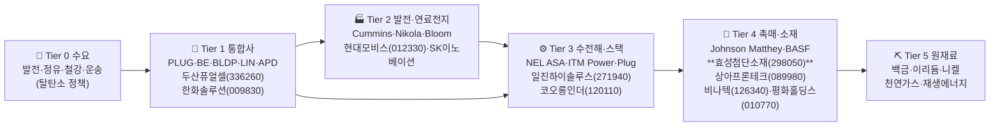

### Tier별 상세

```yaml
tier_0_demand:
  role: "탈탄소 수요 — 정부 보조금 의존"
  drivers:
    - "美 IRA 45V 수소세액공제 (kg당 최대 $3)"
    - "EU REPowerEU (그린수소 1천만톤)"
    - "한국 수소법 (CHPS 의무비율)"
    - "철강 (POSCO HBI), 정유 (그린수소 대체)"
  signal: "IRA 45V 가이던스 변경 → 全 수소주 즉시 가격 반영"

tier_1_integrators:
  role: "수소 종합 (생산·유통·연료전지)"
  players_us:
    - {ticker: PLUG, role: "Plug Power — 전해조·연료전지"}
    - {ticker: BE, role: "Bloom Energy — SOFC"}
    - {ticker: BLDP, role: "Ballard — PEM"}
    - {ticker: LIN, role: "Linde — 산업가스"}
    - {ticker: APD, role: "Air Products — 그린수소 megaprojects"}
  players_kr:
    - {name: "두산퓨얼셀", ticker: "336260", role: "발전용 연료전지 1위"}
    - {name: "한화솔루션", ticker: "009830", role: "수전해·태양광"}
    - {name: "효성중공업", ticker: "298040", role: "수소충전소·압축기"}

tier_2_fuelcell_power:
  role: "차량용·발전용 연료전지·수소차"
  players_kr:
    - {name: "현대모비스", ticker: "012330", role: "수소차 연료전지 모듈"}
    - {name: "SK이노베이션", ticker: "096770", role: "암모니아·수소"}
    - {name: "포스코홀딩스", ticker: "005490", role: "HBI 수소환원제철"}
  players_us: [Cummins, Nikola, Bloom Energy]

tier_3_electrolyzer:
  role: "수전해 스택 (PEM·SOEC·Alkaline)"
  players_global:
    - {company: "NEL ASA", country: "노르웨이"}
    - {company: "ITM Power", country: "영국"}
    - {ticker: PLUG, role: "Giga 전해조 fab"}
  players_kr:
    - {name: "일진하이솔루스", ticker: "271940", role: "수소탱크 (Type 4)"}
    - {name: "코오롱인더스트리", ticker: "120110", role: "PEM 멤브레인 (전해질막)"}
    - {name: "두산", ticker: "000150", role: "수전해 (트라이젠)"}
  cost_drivers: [백금, 이리듐, PEM 멤브레인]

tier_4_catalyst_materials:
  role: "촉매·MEA·BiPolar Plate·탱크 라이너"
  players_kr:
    - {name: "효성첨단소재", ticker: "298050", role: "**탄소섬유** (수소탱크 必)"}
    - {name: "상아프론테크", ticker: "089980", role: "**MEA·전해질막** (PEM 핵심)"}
    - {name: "비나텍", ticker: "126340", role: "수퍼커패시터·수소촉매"}
    - {name: "평화홀딩스", ticker: "010770", role: "수소탱크 부품"}
    - {name: "지필러스", ticker: "비상장", role: "촉매"}
    - {name: "에스퓨얼셀", ticker: "288620", role: "건물용 연료전지"}
  players_global: [Johnson Matthey(촉매), BASF, Toray(탄소섬유)]
  cost_drivers: [백금, 이리듐, 탄소섬유, 불소수지]
  signal_map:
    - "IRA 45V 최종 가이던스 우호적 → PLUG·APD + 효성첨단소재(탄소섬유) 6~12개월"
    - "현대차 NEXO 후속 양산 → 현대모비스 + 일진하이솔루스 + 효성첨단소재 즉시"
    - "이리듐 가격 30%↑ → 수전해 스택 원가 부담 (NEL·PLUG 마진 압박)"
    - "포스코 HBI 상용화 → 그린수소 수요 폭증 (장기 35~50년)"

tier_5_raw:
  role: "촉매 금속·연료"
  materials:
    - {name: "백금(Pt)", source: "남아공·러시아", use: "PEM 촉매"}
    - {name: "이리듐(Ir)", source: "남아공", use: "PEM 산화전극 (희소)"}
    - {name: "니켈(Ni)", source: "인니·필리핀", use: "Alkaline·SOFC"}
    - {name: "천연가스", use: "그레이/블루수소 원료"}
  link: "[[01-commodities#백금]] [[01-commodities#이리듐]]"
```

### 한국 소부장 요약표

| 티어 | 수혜 1순위 (원청) | 한국 알파 | 위험 신호 |
|---|---|---|---|
| Tier 1 | IRA 45V | 두산퓨얼셀(336260)·한화솔루션(009830) | 45V 가이던스 보수화 |
| Tier 2 | NEXO·HBI | 현대모비스(012330)·포스코홀딩스(005490) | 수소차 보급 부진 |
| Tier 3 | PEM 수전해 | 일진하이솔루스(271940)·코오롱인더(120110) | 알칼라인 우위 전환 |
| Tier 4 | 탄소섬유 탱크 | **효성첨단소재(298050)** ← Toray 대체 hidden | Toray 증설 |
| Tier 4 | MEA | **상아프론테크(089980)** ← PEM 핵심 | 미국 IRA 국산화 요건 |
| Tier 5 | 이리듐 | 글로벌 공급 부족 — 가격 변동성 극대 | 남아공 광산 사고 |

---

## 종합: 시그널 맵 (Tier 0/1 이벤트 → Tier 4 KR 알파 시차)

| 트리거 이벤트 | 즉시 (T+0) | 단기 (T+1~3개월) | 중기 (T+6~12개월) | 장기 (T+12개월+) |
|---|---|---|---|---|
| NVDA HBM 가이던스↑ | NVDA·SK하이닉스 | 솔브레인·한솔케미칼 | 동진쎄미켐·HPSP | 원익IPS 장비 발주 |
| TSLA Optimus 양산 | TSLA·레인보우로보틱스 | 두산로보틱스 | **에스비비테크** (감속기) | 하이젠모터·로보티즈 |
| MSFT/GOOGL SMR PPA | SMR·CCJ | 두산에너빌리티 (단조) | 한국전력기술 | 우진엔텍·일진파워 |
| 대형 해킹 사고 | CRWD·PANW | 안랩·지니언스 | 한싹·시큐브 | 라온시큐어 |
| 폴란드 K2 추가계약 | 현대로템 | 풍산(탄약) | SNT다이내믹스 | KAI·한화에어로 |
| WuXi BIOSECURE 시행 | WuXi 급락 | 삼성바이오로직스 | SK바이오사이언스 | 셀트리온 시밀러 |
| LLY GLP-1 capex 부족 | LLY·NVO | — | 펩트론 | **에스티팜** (올리고) |
| GOOGL Willow급 QEC | IBM·GOOGL·IONQ | 全 양자 sector | SKT·KT (QKD) | (한국 직접 알파 적음) |
| IRA 45V 우호 가이던스 | PLUG·APD | 두산퓨얼셀 | **효성첨단소재** | 상아프론테크 (MEA) |

---

## 메타 정보

- **검증**: 모든 종목은 (1) 사업보고서 매출 비중 또는 (2) 공시·IR 자료 기준 해당 Tier에 해당. 추정·억지 매핑 배제 ([[CLAUDE.md#개발-규칙]] 검증 규칙).
- **연동**:
  - Tier 5 원재료 → [[01-commodities]] (네온·갈륨·우라늄·이리듐 등)
  - Tier 0 매크로 신호 → [[02-indicators]] (Hyperscaler Capex·국방예산·IRA)
  - 섹터별 Outlook → [[03-outlook]] (Phase 1 매크로 전망과 연결)
- **업데이트 주기**: 분기 (어닝 시즌 종료 후 Tier 1 가이던스 반영)
- **다음 단계 (Phase 3-2)**: 종목별 비중·재무·기술적 종합 스크리닝

---

# Part B — 한국 제조 주력 6개 섹터 Value Chain

# Value Chain — 한국 제조 주력 6개 섹터

> 한국 투자자 관점에서 글로벌 OEM/원청의 뉴스가 어느 한국 소부장 종목으로 전이되는지를 즉시 추적하기 위한 Tier 0~5 매핑.
> Tier 4(소재·화학·정밀부품)가 한국 알파의 핵심 — 가장 깊게 다룸.

## Tier 정의 (공통)
- **Tier 0**: 최종 수요 (소비자·정부·발전소)
- **Tier 1**: 원청·브랜드 (Tesla·삼성전자·HD현대·POSCO 등)
- **Tier 2**: 제조·조립 (셀 제조·OEM 조립·조선소·제강·패널)
- **Tier 3**: 장비·핵심부품 (제조장비·엔진·구동모터)
- **Tier 4**: 소재·화학·정밀부품 ← **한국 소부장 알파**
- **Tier 5**: 원재료·광물

---

## 9. 이차전지/배터리

### Mermaid
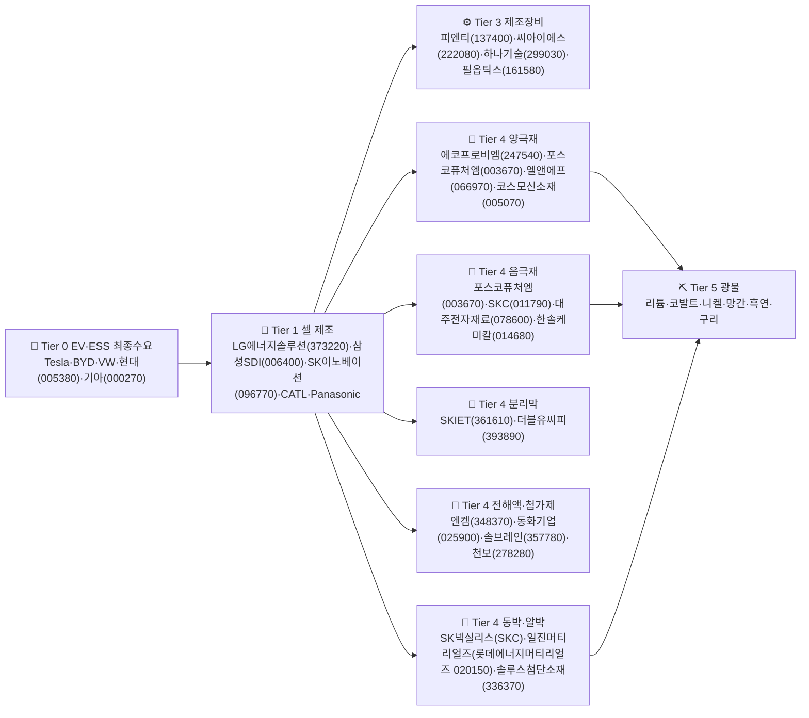

### Tier별 YAML 상세
```yaml
tier_0_demand:
  role: "EV·ESS 최종수요 — 차량 판매 대수 = 셀 수요 직결"
  players_global: [Tesla, BYD, Volkswagen, Ford, Stellantis, GM]
  players_kr:
    - {name: "현대차", ticker: "005380", role: "아이오닉5/6/7, 코나EV"}
    - {name: "기아", ticker: "000270", role: "EV6/EV9, 니로EV"}
  signal_map:
    - "Tesla 분기 인도량 +10% → 한국 셀3사 매출 1-2개월 시차로 반영"
    - "중국 NEV 보조금 종료 → 글로벌 셀 점유율 재편, 한국 셀 반사이익"

tier_1_cell:
  role: "배터리 셀 제조 — 산업 부가가치의 25-30%"
  players_kr:
    - {name: "LG에너지솔루션", ticker: "373220", role: "원통형/파우치, GM·테슬라·VW 공급"}
    - {name: "삼성SDI", ticker: "006400", role: "각형/원통형, BMW·Stellantis·Rivian"}
    - {name: "SK이노베이션(SK온)", ticker: "096770", role: "파우치, 포드·현대·VW"}
  cost_drivers: [양극재, 음극재, 분리막, 전해액, 노동·전력]
  signal_map:
    - "AMPC(IRA 보조금) 정책 변경 → 미국 공장 가동률·이익 직격"
    - "리튬 가격 -30% → 셀 판가 하락 + 마진 압박 6개월 lag"

tier_3_equipment:
  role: "셀 제조장비 — 신규 공장 capex 사이클 의존"
  players_kr:
    - {name: "피엔티", ticker: "137400", role: "코터/캘린더 장비, LG엔솔·SK온"}
    - {name: "씨아이에스", ticker: "222080", role: "코팅·롤프레스 장비"}
    - {name: "하나기술", ticker: "299030", role: "조립·활성화 장비"}
    - {name: "필옵틱스", ticker: "161580", role: "노칭·레이저 장비"}
  signal_map:
    - "셀3사 capex 가이던스 -20% → 장비주 수주 6-12개월 lag로 감소"
    - "신규 공장 발표(ex. 북미 합작) → 장비주 즉시 수주 모멘텀"

tier_4_cathode:
  role: "양극재 제조 — 셀 원가의 30-40% 차지, 가장 큰 한국 알파"
  players_kr:
    - {name: "에코프로비엠", ticker: "247540", role: "NCM/NCA 하이니켈 양극재, 삼성SDI·SK온"}
    - {name: "포스코퓨처엠", ticker: "003670", role: "NCM 양극재 + 음극재 동시 영위, LG엔솔"}
    - {name: "엘앤에프", ticker: "066970", role: "NCMA 양극재, LG엔솔·테슬라"}
    - {name: "코스모신소재", ticker: "005070", role: "NCM 양극재, 삼성SDI"}
  cost_drivers: [리튬, 코발트, 니켈, 망간, 전구체]
  signal_map:
    - "리튬(탄산리튬) 가격 -50% → 양극재 판가 하락 + 재고평가손, 마진 회복 6-9개월"
    - "Tesla 모델3 인도 +20% → 양극재 발주 1-2개월 시차로 증가"
    - "중국 CATL 하이니켈 진입 가속 → 한국 NCM 점유율 위협"

tier_4_anode:
  role: "음극재 제조 — 흑연계 + 실리콘계, 셀 원가 8-12%"
  players_kr:
    - {name: "포스코퓨처엠", ticker: "003670", role: "천연·인조흑연 음극재, 국내 유일 일관생산"}
    - {name: "SKC", ticker: "011790", role: "동박·실리콘 음극재, 차세대 소재 진입"}
    - {name: "대주전자재료", ticker: "078600", role: "실리콘 음극재, 포르쉐 타이칸 채택"}
    - {name: "한솔케미칼", ticker: "014680", role: "실리콘 음극재 바인더 + 과산화수소"}
  cost_drivers: [흑연, 실리콘, 피치]
  signal_map:
    - "중국 흑연 수출통제 강화 → 한국 인조흑연 자립 모멘텀"
    - "실리콘 음극재 채택 EV 출시(BMW·포르쉐) → 대주전자재료·한솔케미칼 수혜"

tier_4_separator:
  role: "분리막 — 셀 안전·수명 좌우, 진입장벽 매우 높음"
  players_kr:
    - {name: "SKIET", ticker: "361610", role: "습식 분리막, LG엔솔·삼성SDI 주공급, 시장 저평가"}
    - {name: "더블유씨피", ticker: "393890", role: "습식 분리막, 삼성SDI 전속 가까움"}
  cost_drivers: [폴리에틸렌(PE), 가소제]
  signal_map:
    - "EV 화재 사고 → 분리막 안전 스펙 강화, 프리미엄 분리막 수요 증가"
    - "셀 capex 둔화 + 분리막 공급과잉 → 가동률 하락, 마진 압박"

tier_4_electrolyte:
  role: "전해액·첨가제 — 셀 원가 8-10%, 첨가제는 진입장벽 높음"
  players_kr:
    - {name: "엔켐", ticker: "348370", role: "전해액 글로벌 점유율 상위, 미국 공장"}
    - {name: "동화기업", ticker: "025900", role: "전해액 + 보드, LG엔솔·SK온"}
    - {name: "솔브레인", ticker: "357780", role: "전해액 + 반도체 공정화학, 삼성SDI"}
    - {name: "천보", ticker: "278280", role: "전해질 첨가제(LiFSI 등), 고부가"}
  cost_drivers: [LiPF6, 유기용매(EC, DMC), 첨가제]
  signal_map:
    - "LiPF6 가격 +30% → 전해액 판가 인상 + 마진 확대"
    - "첨가제 LiFSI 채택 가속(고전압 셀) → 천보 ASP 상승"

tier_4_foil:
  role: "동박·알루미늄박 — 음극·양극 집전체, 셀 원가 5-8%"
  players_kr:
    - {name: "롯데에너지머티리얼즈", ticker: "020150", role: "(구 일진머티리얼즈) 동박, LG엔솔·삼성SDI"}
    - {name: "솔루스첨단소재", ticker: "336370", role: "전지박(동박) + OLED 소재, 헝가리 공장"}
    - {name: "SKC", ticker: "011790", role: "SK넥실리스 동박, 글로벌 1위급"}
  cost_drivers: [구리, 전기료]
  signal_map:
    - "구리 가격 +20% → 동박 판가 전가 가능, 마진 중립"
    - "동박 공급과잉 + 가공비 하락 → 가동률 80% 미만 시 적자 전환"

tier_5_minerals:
  role: "원재료 광물 — 가격 변동성이 Tier 4 마진 직격"
  commodities: [리튬(탄산·수산화), 코발트, 니켈(클래스1), 망간, 흑연, 구리]
  signal_map:
    - "리튬 가격 -50% → 양극재 판가 하락 + 재고평가손 (양극재 단기 충격)"
    - "코발트 가격 +30% → NCM 비중 축소, LFP 채택 가속 (한국 NCM 위협)"
    - "인니 니켈 수출세 인상 → 클래스1 니켈 가격 +15%"
```

### 한국 소부장 요약표
| 티어 | 글로벌 수혜 1순위 | 한국 알파 | 위험 신호 |
|---|---|---|---|
| Tier 1 셀 | LG엔솔·삼성SDI·SK온 | 373220·006400·096770 | AMPC 축소, 중국 LFP 잠식 |
| Tier 3 장비 | LG엔솔 capex | 137400·222080·161580 | 셀3사 capex 가이던스 하향 |
| Tier 4 양극재 | CATL·LG엔솔 | 247540·003670·066970 | 리튬 급락 + 중국 하이니켈 진입 |
| Tier 4 음극재 | LG엔솔·BMW | 003670·078600·014680 | 중국 흑연 덤핑 |
| Tier 4 분리막 | LG엔솔·삼성SDI | **361610**(저평가)·393890 | 공급과잉 + 가동률 하락 |
| Tier 4 전해액 | LG엔솔·SK온 | 348370·278280 | LiPF6 가격 급락 |
| Tier 4 동박 | LG엔솔·삼성SDI | 020150·336370·011790 | 가공비 하락, 가동률 부진 |
| Tier 5 광물 | 트레이더·광산사 | (직접 노출 적음) | 리튬·코발트 변동성 |

---

## 10. 전기차 완성차

### Mermaid
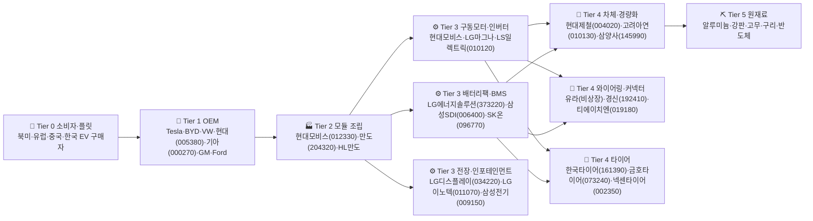

### Tier별 YAML 상세
```yaml
tier_0_consumer:
  role: "EV 최종 소비자 — 보조금·금리·전기료에 민감"
  signal_map:
    - "미국 7,500달러 EV 세액공제 축소 → 북미 EV 수요 -15%"
    - "유럽 ICE 2035 금지 후퇴 논의 → 장기 EV 침투율 하향"

tier_1_oem:
  role: "OEM 브랜드 — 차량 가격·마진·믹스 결정"
  players_kr:
    - {name: "현대차", ticker: "005380", role: "아이오닉·코나·EV9, E-GMP 플랫폼"}
    - {name: "기아", ticker: "000270", role: "EV6·EV9·니로, 현대차와 플랫폼 공유"}
  players_global: [Tesla, BYD, VW, Ford, GM, Stellantis, Toyota, Rivian]
  signal_map:
    - "Tesla 가격 인하 → 현대차·기아 EV 마진 압박"
    - "현대차 인도 IPO → 신흥국 EV 노출 확대"

tier_2_module:
  role: "모듈 통합 — Tier1 부품을 OEM에 공급"
  players_kr:
    - {name: "현대모비스", ticker: "012330", role: "PE 모듈(모터+인버터+감속기), 현대·기아 전속"}
    - {name: "HL만도", ticker: "204320", role: "(구 만도) 브레이크·조향, ADAS 확대"}
  signal_map:
    - "현대차 EV 비중 +5%pt → 모비스 PE 모듈 매출 비례 증가"
    - "ADAS L3 채택 가속 → HL만도 ASP 상승"

tier_3_motor:
  role: "구동모터·인버터·감속기 — EV 핵심 구동계"
  players_kr:
    - {name: "현대모비스", ticker: "012330", role: "PE 통합 모듈"}
    - {name: "LS일렉트릭", ticker: "010120", role: "산업용 인버터·전기차 부품"}
    - {name: "LG마그나(비상장)", ticker: "-", role: "LG전자+마그나 합작, GM·재규어"}
  cost_drivers: [네오디뮴, 구리, 강판, 반도체(IGBT/SiC)]
  signal_map:
    - "SiC 전력반도체 채택 → 인버터 효율 +5%, ASP 상승"
    - "네오디뮴 가격 +30% → 영구자석 모터 원가 압박"

tier_3_battery_pack:
  role: "팩·BMS — 셀을 차량 통합"
  players_kr: [{name: "LG에너지솔루션", ticker: "373220"}, {name: "삼성SDI", ticker: "006400"}, {name: "SK이노베이션", ticker: "096770"}]
  signal_map:
    - "Cell-to-Pack(CTP) 기술 채택 → 에너지밀도 +15%, 모듈 단계 생략"

tier_3_electronics:
  role: "전장·인포테인먼트·카메라"
  players_kr:
    - {name: "LG디스플레이", ticker: "034220", role: "차량용 OLED·LTPS LCD"}
    - {name: "LG이노텍", ticker: "011070", role: "카메라 모듈, ADAS·자율주행"}
    - {name: "삼성전기", ticker: "009150", role: "MLCC·카메라 모듈, EV는 ICE 대비 MLCC 사용량 3-5배"}
  signal_map:
    - "EV 침투율 +10%pt → MLCC 수요 비선형 급증 (삼성전기 핵심 모멘텀)"
    - "ADAS 카메라 채널 4ch→8ch → LG이노텍 ASP 상승"

tier_4_body:
  role: "차체·경량화 소재"
  players_kr:
    - {name: "현대제철", ticker: "004020", role: "자동차강판, 현대·기아 전속"}
    - {name: "고려아연", ticker: "010130", role: "아연·연·은, 도금강판 + 동박 진출"}
    - {name: "삼양사", ticker: "145990", role: "엔지니어링 플라스틱"}
  signal_map:
    - "EV 경량화 → 알루미늄·CFRP 비중 증가, 강판 비중 감소"

tier_4_wiring:
  role: "와이어링 하네스·커넥터 — EV는 ICE 대비 와이어 길이 2배"
  players_kr:
    - {name: "경신", ticker: "192410", role: "와이어링 하네스, 현대·기아"}
    - {name: "티에이치엔", ticker: "019180", role: "와이어링·커넥터"}
  signal_map:
    - "EV 침투율 상승 → 와이어링 매출 1.5-2배 증가"

tier_4_tire:
  role: "타이어 — EV는 무게·토크로 마모 빠름, 교체 주기 짧음"
  players_kr:
    - {name: "한국타이어", ticker: "161390", role: "OE+RE, EV 전용 타이어 iON"}
    - {name: "금호타이어", ticker: "073240", role: "OE 비중 확대"}
    - {name: "넥센타이어", ticker: "002350", role: "RE 중심"}
  cost_drivers: [천연고무, 합성고무, 카본블랙, 원유]
  signal_map:
    - "원유 -20% → 합성고무·카본블랙 원가 하락, 타이어 마진 +200bp"
    - "EV 침투율 상승 → EV 전용 타이어 ASP +20-30%"

tier_5_raw:
  role: "차량 원재료"
  commodities: [열연강판, 알루미늄, 구리, 천연고무, 반도체]
  signal_map:
    - "차량용 반도체 부족 재발 → OEM 생산 차질, Tier 1·2 동반 충격"
```

### 한국 소부장 요약표
| 티어 | 글로벌 수혜 1순위 | 한국 알파 | 위험 신호 |
|---|---|---|---|
| Tier 1 OEM | Tesla·BYD | 005380·000270 | EV 가격경쟁 격화 |
| Tier 2/3 모듈·모터 | Tesla 4680·CTP | 012330·204320·010120 | 현대차 EV 판매 둔화 |
| Tier 3 전장 MLCC | EV 침투율 | **009150**(MLCC 비선형)·011070 | ICE 회귀, ADAS 지연 |
| Tier 4 와이어링 | EV 비중 | 192410·019180 | 알루미늄 와이어 대체 |
| Tier 4 타이어 | EV·SUV 비중 | 161390·073240 | 원유 급등, 운임 상승 |
| Tier 4 차체 | 현대·기아 | 004020·010130 | EV 경량화로 강판 비중 ↓ |

---

## 11. EV 소재/부품 (양극재·음극재·분리막·전해액 심화)

> Sector 9와 중복되는 부분을 더 깊게 파고들어, 셀제조사 → 4대 소재 → 원료 광물의 역전이 신호를 정리.

### Mermaid
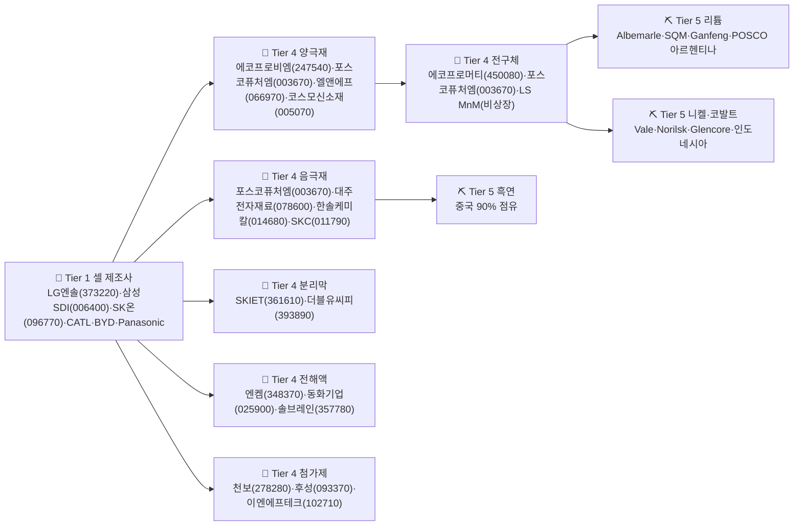

### Tier별 YAML 상세
```yaml
tier_4_precursor:
  role: "전구체(NCM Hydroxide) — 양극재 직전 단계, 중국 의존도 95%+"
  players_kr:
    - {name: "에코프로머티", ticker: "450080", role: "전구체 + 폐배터리 리사이클"}
    - {name: "포스코퓨처엠", ticker: "003670", role: "전구체 일관생산 (광양/포항)"}
  cost_drivers: [니켈, 코발트, 망간, 황산]
  signal_map:
    - "중국 전구체 수출통제 강화 → 한국 전구체 자립 모멘텀, 에코프로머티·포스코퓨처엠 수혜"
    - "IRA FEOC(우려국가) 규제 시행 → 한국 전구체 ASP 프리미엄"

tier_4_cathode_deep:
  role: "양극재 화학별 분화"
  segments:
    - {chem: "NCM/NCMA", players: ["에코프로비엠", "엘앤에프", "포스코퓨처엠"], use: "고급 EV(테슬라·현대·기아·BMW)"}
    - {chem: "LFP", players: ["에코프로비엠(진입)", "LG화학(신규)"], use: "보급형 EV·ESS"}
    - {chem: "리튬망간리치(LMR)", players: ["엘앤에프(개발)"], use: "차세대"}
  signal_map:
    - "LFP 침투율 +10%pt(글로벌) → 한국 NCM 점유율 -3-5%pt 압박"
    - "테슬라 모델Y LFP→NCM 전환 → 한국 양극재 발주 증가"

tier_4_anode_silicon:
  role: "실리콘 음극재 — 차세대 고밀도, 한국 선도"
  players_kr:
    - {name: "대주전자재료", ticker: "078600", role: "포르쉐 타이칸·아우디 etron 채택"}
    - {name: "한솔케미칼", ticker: "014680", role: "실리콘 + 바인더 + 과산화수소"}
    - {name: "나노신소재", ticker: "121600", role: "CNT 도전재(실리콘 음극재 필수)"}
  signal_map:
    - "실리콘 음극재 채택률 5%→15% (2027) → 대주전자재료·한솔케미칼 매출 3배 잠재력"

tier_4_separator_deep:
  role: "분리막 — 진입장벽 매우 높음, 시장 저평가"
  players_kr:
    - {name: "SKIET", ticker: "361610", role: "습식 PE 분리막, LG엔솔·삼성SDI·SK온"}
    - {name: "더블유씨피", ticker: "393890", role: "습식 분리막, 삼성SDI 전속 가까움"}
  hidden_alpha: "SKIET — 셀3사 capex 사이클 회복 + 중국 분리막 IRA 배제 시 ASP 프리미엄, 시장이 저평가"
  signal_map:
    - "EV 화재 사고 → 안전 분리막(세라믹 코팅) 채택 가속, ASP +30%"

tier_4_additive:
  role: "전해질 첨가제·LiFSI — 고전압·고에너지 셀 필수"
  players_kr:
    - {name: "천보", ticker: "278280", role: "LiFSI·LiPO2F2 첨가제, 글로벌 점유 상위"}
    - {name: "후성", ticker: "093370", role: "LiPF6 + 냉매"}
    - {name: "이엔에프테크놀로지", ticker: "102710", role: "전해액 첨가제 + 반도체 화학"}
  signal_map:
    - "고전압(4.4V+) 셀 채택 → LiFSI 첨가제 수요 폭증, 천보 ASP +50%"

tier_5_lithium:
  role: "리튬 광산·정제"
  players_global: [Albemarle, SQM, Ganfeng, Tianqi, Pilbara]
  korean_exposure:
    - {name: "POSCO홀딩스", ticker: "005490", role: "아르헨티나 옴브레무에르토 염호 + 호주 필바라 지분"}
    - {name: "포스코퓨처엠", ticker: "003670", role: "POSCO 그룹 리튬 다운스트림"}
  signal_map:
    - "리튬 가격 -50% → POSCO 리튬 사업 적자 + 양극재 재고평가손"
    - "리튬 가격 회복(+30%) → POSCO홀딩스 멀티플 재평가"

tier_5_nickel_cobalt:
  role: "니켈·코발트 — 인도네시아·콩고 집중"
  signal_map:
    - "인니 니켈 수출세 → 클래스1 니켈 +15%, NCM 양극재 원가 +5-7%"
    - "콩고 코발트 정정 불안 → 코발트 +30%, NCM 비중 축소 압박"

tier_5_graphite:
  role: "흑연 — 중국 90% 점유, 수출통제 리스크"
  signal_map:
    - "중국 흑연 수출허가제 강화 → 한국 인조흑연 자립 가속, 포스코퓨처엠 수혜"
    - "Syrah(모잠비크) 천연흑연 가동 → 공급 다변화"
```

### 한국 소부장 요약표
| 티어 | 글로벌 수혜 1순위 | 한국 알파 | 위험 신호 |
|---|---|---|---|
| Tier 4 전구체 | LG엔솔·SK온 | 450080·003670 | 중국 전구체 덤핑 |
| Tier 4 양극재 NCM | LG엔솔·삼성SDI | 247540·066970·003670 | LFP 침투, 리튬 급락 |
| Tier 4 실리콘 음극 | 포르쉐·BMW | **078600**·014680·121600 | 채택 지연 |
| Tier 4 분리막 | LG엔솔·삼성SDI | **361610**(저평가)·393890 | 공급과잉 |
| Tier 4 첨가제 LiFSI | 고전압 셀 | **278280**·093370 | 저전압 회귀 |
| Tier 5 리튬 | Albemarle·SQM | 005490(POSCO홀딩스) | 리튬 가격 급락 |
| Tier 5 흑연 | 포스코퓨처엠 | 003670 | 중국 덤핑 재개 |

---

## 12. 조선

### Mermaid
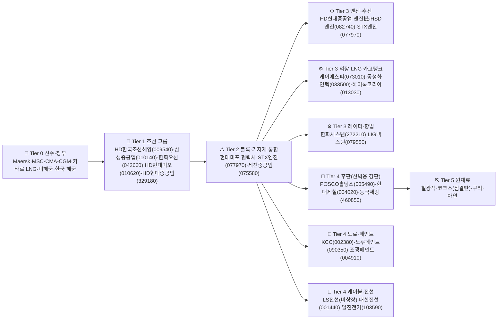

### Tier별 YAML 상세
```yaml
tier_0_owner:
  role: "선주·정부 발주처"
  segments:
    - {seg: "컨테이너", clients: [Maersk, MSC, CMA-CGM, COSCO, ONE]}
    - {seg: "LNG", clients: [QatarEnergy, Shell, BP, NYK]}
    - {seg: "탱커·벌커", clients: [Frontline, Scorpio, 그리스 선주]}
    - {seg: "방산(군함)", clients: [한국 해군, 미해군, 폴란드, 호주, 캐나다]}
  signal_map:
    - "IMO 환경규제(EEXI/CII) 강화 → 노후선 폐선 + LNG·메탄올 추진선 발주 증가"
    - "카타르 LNG 2차 발주(40+척) → 한국 빅3 슬롯 확보 = 4-5년 매출 가시성"
    - "미국 함정 MRO 한국 개방 → 한화오션·HD현대중공업 방산 매출 확대"

tier_1_yard:
  role: "조선소 — 빅3 + 미포(중형)"
  players_kr:
    - {name: "HD한국조선해양", ticker: "009540", role: "현대重·미포·삼호 지주, LNG·컨테이너 강자"}
    - {name: "삼성중공업", ticker: "010140", role: "LNG·드릴십, FLNG"}
    - {name: "한화오션", ticker: "042660", role: "(구 대우조선해양) LNG·잠수함·군함"}
    - {name: "HD현대미포", ticker: "010620", role: "중형 PC선·MR탱커·메탄올"}
    - {name: "HD현대중공업", ticker: "329180", role: "벌커·VLCC·해양플랜트·엔진"}
  signal_map:
    - "신조선가 +10% → 한국 빅3 영업이익 +30% (operating leverage)"
    - "원/달러 +5% → 매출 환산 이익 + (수주는 달러 표기, 원가 일부 원화)"

tier_3_engine:
  role: "엔진 — 선박 원가의 10-15%"
  players_kr:
    - {name: "HD현대중공업 엔진機", ticker: "329180", role: "MAN-ES 라이선스, 글로벌 점유 1위"}
    - {name: "HSD엔진", ticker: "082740", role: "(한화 인수) 2-stroke 대형엔진"}
    - {name: "STX엔진", ticker: "077970", role: "중형엔진·방산"}
  signal_map:
    - "메탄올·암모니아 추진선 채택 → 신형 엔진 수주 + ASP 상승"
    - "LNG선 슬롯 차오름 → 엔진 수주 6-12개월 lag로 증가"

tier_3_lng_cargo:
  role: "LNG 카고탱크·의장재 — LNG선 부가가치 핵심"
  players_kr:
    - {name: "동성화인텍", ticker: "033500", role: "LNG 보냉재(폴리우레탄), 글로벌 1위"}
    - {name: "케이에스피", ticker: "073010", role: "선박 의장 단조"}
    - {name: "하이록코리아", ticker: "013030", role: "피팅·밸브, LNG·반도체"}
  signal_map:
    - "LNG선 인도 사이클 정점 → 동성화인텍 매출 1-2년 가시성"
    - "Mark III/Mk5 박스 채택 변화 → 보냉재 ASP 변동"

tier_3_radar_naval:
  role: "방산 의장(레이더·전투체계) — 한국형 차기구축함·잠수함"
  players_kr:
    - {name: "한화시스템", ticker: "272210", role: "함정 레이더·전투체계"}
    - {name: "LIG넥스원", ticker: "079550", role: "함대공·함대함 미사일"}
  signal_map:
    - "폴란드·호주·사우디 함정 수주 → 한화시스템·LIG넥스원 동반 수주"

tier_4_plate:
  role: "후판(선박용 강판) — 선박 원가 20-25%"
  players_kr:
    - {name: "POSCO홀딩스", ticker: "005490", role: "후판 글로벌 톱티어"}
    - {name: "현대제철", ticker: "004020", role: "후판 + 자동차강판"}
    - {name: "동국제강", ticker: "460850", role: "후판 + 컬러강판"}
  signal_map:
    - "후판 가격 +10% → 조선소 원가 +2-3%pt, 빅3 마진 압박"
    - "수주잔고 4년치 + 후판 장기계약 → 조선소 마진 가시성"

tier_4_paint:
  role: "선박 도료 — 원가 비중 작지만 마진 방어"
  players_kr:
    - {name: "KCC", ticker: "002380", role: "선박·건축 도료, 글로벌 5위권"}
    - {name: "노루페인트", ticker: "090350", role: "선박·자동차"}
    - {name: "조광페인트", ticker: "004910", role: "선박·산업"}
  signal_map:
    - "선박 인도량 +20% → KCC 선박도료 매출 1-2분기 lag로 증가"

tier_4_cable:
  role: "선박용 케이블·전선"
  players_kr:
    - {name: "대한전선", ticker: "001440", role: "해저케이블 + 선박케이블"}
    - {name: "일진전기", ticker: "103590", role: "송전·배전 + 선박"}
  signal_map:
    - "해상풍력 +해저케이블 동시 호황 → 대한전선 멀티 모멘텀"

tier_5_raw:
  role: "철광석·코크스 — 후판 원가 80%"
  signal_map:
    - "철광석 +20% → 후판 가격 +10% lag → 조선소 마진 -1-2%pt"
    - "코크스(점결탄) 가격 급락 → 후판 원가 하락, 조선소 마진 회복"
```

### 한국 소부장 요약표
| 티어 | 글로벌 수혜 1순위 | 한국 알파 | 위험 신호 |
|---|---|---|---|
| Tier 1 빅3+미포 | 카타르 LNG·미해군 | 009540·010140·042660·010620·329180 | 신조선가 하락, 후판 급등 |
| Tier 3 엔진 | 메탄올·암모니아 추진 | 329180·082740·077970 | 친환경 추진 채택 지연 |
| Tier 3 LNG 보냉재 | LNG선 인도 | **033500**·073010·013030 | LNG선 사이클 둔화 |
| Tier 3 방산 의장 | 폴란드·호주 함정 | 272210·079550 | 수주 경쟁 격화 |
| Tier 4 후판 | POSCO·현대제철 | 005490·004020·460850 | 조선소 가격 협상력 강화 |
| Tier 4 도료 | 선박 인도량 | 002380·090350 | 환경규제 코팅 변경 |

---

## 13. 철강/비철

### Mermaid
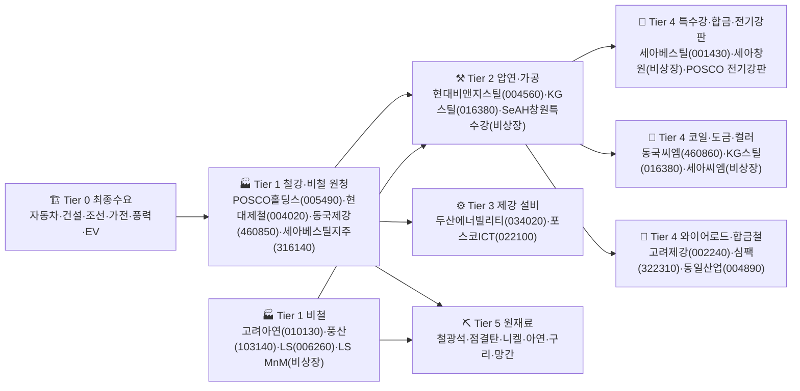

### Tier별 YAML 상세
```yaml
tier_0_demand:
  role: "철강·비철 최종수요 — 매크로 사이클 직격"
  segments:
    - {seg: "자동차강판", driver: "글로벌 자동차 생산"}
    - {seg: "후판(조선)", driver: "조선 수주잔고"}
    - {seg: "건설용 철근·H형강", driver: "주택 착공·인프라"}
    - {seg: "전기강판", driver: "EV 모터·풍력 발전기·변압기"}
    - {seg: "구리·동", driver: "전력망·반도체·EV"}
  signal_map:
    - "중국 부동산 침체 → 글로벌 철강 수요 -5%, 가격 압박"
    - "미국 변압기 부족 + 풍력 capex → 전기강판 수요 폭증, POSCO 알파"
    - "EV 침투율 → 전기강판 + 구리 동시 수혜"

tier_1_steel:
  role: "철강 원청 — 고로(BF)·전기로(EAF) 운영"
  players_kr:
    - {name: "POSCO홀딩스", ticker: "005490", role: "고로 빅2, 자동차강판·후판·전기강판 + 리튬·니켈"}
    - {name: "현대제철", ticker: "004020", role: "고로 + 전기로, 현대차 전속 자동차강판"}
    - {name: "동국제강", ticker: "460850", role: "전기로, 후판·컬러강판 분할 후 사업회사"}
    - {name: "세아베스틸지주", ticker: "316140", role: "특수강 지주, 자동차·산업기계"}
  signal_map:
    - "철광석 -20% + 점결탄 -30% → POSCO·현대제철 마진 +200-300bp"
    - "중국 철강 수출 +10% → 한국 가격 -5%, 마진 압박"
    - "POSCO 전기강판 capex 완공 → 미국 변압기·EV 모터 매출 본격화"

tier_1_nonferrous:
  role: "비철금속 원청"
  players_kr:
    - {name: "고려아연", ticker: "010130", role: "아연·연·은 글로벌 1위, 동박·전구체 신사업"}
    - {name: "풍산", ticker: "103140", role: "동·황동, 방산(탄약)"}
    - {name: "LS", ticker: "006260", role: "LS전선·LS일렉트릭·LS MnM 지주"}
  signal_map:
    - "구리 +20%(전력망 수요) → 풍산·LS MnM 마진 +500bp"
    - "은 가격 +30% → 고려아연 부산물 수익 급증"

tier_2_processing:
  role: "압연·가공 — Tier1 슬래브를 코일·강판으로"
  players_kr:
    - {name: "현대비앤지스틸", ticker: "004560", role: "스테인리스 냉연"}
    - {name: "KG스틸", ticker: "016380", role: "(구 KG동부제철) 컬러강판"}
  signal_map:
    - "스테인리스 마진 압박 + 중국 덤핑 → 현대비앤지스틸 적자 위험"

tier_4_special:
  role: "특수강·전기강판 — 한국 알파의 핵심"
  players_kr:
    - {name: "세아베스틸", ticker: "001430", role: "자동차용 특수강, 현대·기아 전속"}
    - {name: "POSCO 전기강판(POSCO홀딩스)", ticker: "005490", role: "고배향성 전기강판(GO), 변압기·EV 모터"}
  signal_map:
    - "미국 변압기 리드타임 2년+ → 전기강판 ASP +30-50%, POSCO 알파"
    - "EV 모터(영구자석) → 무방향성 전기강판(NO) 수요 급증"

tier_4_coated:
  role: "도금·컬러강판 — 가전·건축"
  players_kr:
    - {name: "동국씨엠", ticker: "460860", role: "(동국제강 분할) 컬러강판 글로벌 톱"}
    - {name: "KG스틸", ticker: "016380", role: "컬러강판"}
  signal_map:
    - "글로벌 가전 수요 회복 → 컬러강판 ASP·물량 동반 회복"

tier_4_wire_alloy:
  role: "와이어로드·합금철"
  players_kr:
    - {name: "고려제강", ticker: "002240", role: "와이어로프·PC강선, 인프라·해상풍력"}
    - {name: "심팩", ticker: "322310", role: "단조·풍력 부품"}
    - {name: "동일산업", ticker: "004890", role: "합금철, 제강 부원료"}
  signal_map:
    - "해상풍력 capex → 고려제강 PC강선·심팩 풍력 단조 동반 수혜"

tier_5_raw:
  role: "원재료"
  commodities: [철광석, 점결탄, 니켈, 아연, 구리, 망간, 크롬]
  signal_map:
    - "철광석 +20% → 후판·열연 +10% lag, Tier1 마진 -200bp"
    - "구리 +20% → 풍산·LS MnM·고려아연 동시 수혜"
    - "아연 +30% → 고려아연 영업이익 비선형 증가"
```

### 한국 소부장 요약표
| 티어 | 글로벌 수혜 1순위 | 한국 알파 | 위험 신호 |
|---|---|---|---|
| Tier 1 철강 | 자동차·조선·인프라 | 005490·004020·460850 | 중국 덤핑, 철광석 급등 |
| Tier 1 비철 | 전력망·EV·방산 | 010130·103140·006260 | 구리·아연 급락 |
| Tier 4 전기강판 | 미국 변압기·EV 모터 | **005490**(POSCO 알파) | 변압기 리드타임 정상화 |
| Tier 4 특수강 | 자동차 | 001430·316140 | 자동차 생산 둔화 |
| Tier 4 컬러강판 | 가전·건축 | 460860·016380 | 가전 수요 둔화 |
| Tier 4 합금·풍력 | 해상풍력 capex | 002240·322310 | 풍력 정책 후퇴 |

---

## 14. 디스플레이

### Mermaid
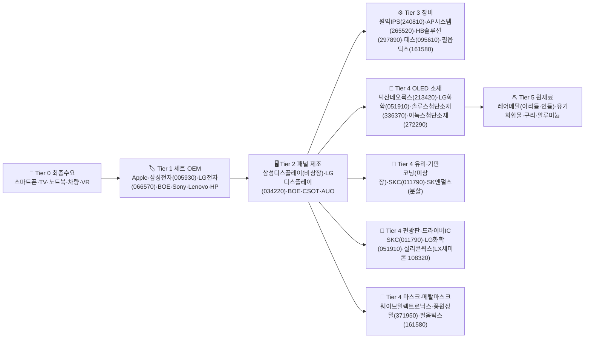

### Tier별 YAML 상세
```yaml
tier_0_demand:
  role: "디스플레이 최종수요"
  segments:
    - {seg: "스마트폰 OLED", driver: "Apple iPhone, 삼성 갤럭시"}
    - {seg: "TV 대형 LCD/OLED", driver: "글로벌 TV 출하"}
    - {seg: "IT(노트북·태블릿)", driver: "OLED 침투율 (저전력)"}
    - {seg: "차량용", driver: "EV 대시보드 OLED 채택"}
    - {seg: "VR/XR", driver: "Apple Vision Pro, Meta Quest"}
  signal_map:
    - "iPhone 17 OLED 패널 발주 +10% → 삼성D·LGD 직접 수혜"
    - "TV 대형 LCD 가격 -20% → BOE·CSOT 점유 확대, LGD 압박"
    - "Apple Vision Pro 2 출시 → Micro-OLED 수요, LGD/SDC 전략 변화"

tier_1_set:
  role: "세트 브랜드"
  players_kr:
    - {name: "삼성전자", ticker: "005930", role: "갤럭시 + TV (자체 패널 SDC)"}
    - {name: "LG전자", ticker: "066570", role: "OLED TV 글로벌 1위 (LGD 패널)"}
  signal_map:
    - "Apple iPhone OLED 채택 100% → SDC·LGD 수주 안정"

tier_2_panel:
  role: "패널 제조"
  players_kr:
    - {name: "LG디스플레이", ticker: "034220", role: "OLED TV·iPhone OLED·차량 OLED"}
    - {name: "삼성디스플레이(비상장, 005930 자회사)", ticker: "-", role: "스마트폰 OLED 글로벌 1위"}
  signal_map:
    - "중국 BOE iPhone 진입 확대 → LGD 가격 협상력 약화"
    - "차량용 OLED 채택 가속 → LGD·SDC 신규 매출"

tier_3_equipment:
  role: "디스플레이 장비"
  players_kr:
    - {name: "원익IPS", ticker: "240810", role: "PECVD·증착장비, 디스플레이+반도체"}
    - {name: "AP시스템", ticker: "265520", role: "ELA(레이저 결정화) 장비, 글로벌 톱"}
    - {name: "HB솔루션", ticker: "297890", role: "검사장비"}
    - {name: "테스", ticker: "095610", role: "PECVD"}
    - {name: "필옵틱스", ticker: "161580", role: "OLED 노광·레이저"}
  signal_map:
    - "8.6세대 OLED capex(SDC·BOE) → 장비 신규 발주, 원익IPS·AP시스템 수주"
    - "Apple iPad OLED 전환 → 8.6세대 장비 사이클 가속"

tier_4_oled_material:
  role: "OLED 발광·소재 — 한국 알파의 핵심"
  players_kr:
    - {name: "덕산네오룩스", ticker: "213420", role: "OLED HTL·정공수송층, SDC 주공급"}
    - {name: "LG화학", ticker: "051910", role: "OLED 발광재료(블루 호스트)"}
    - {name: "이녹스첨단소재", ticker: "272290", role: "OLED 봉지필름·FCCL"}
    - {name: "솔루스첨단소재", ticker: "336370", role: "OLED 발광재료 + 동박"}
    - {name: "피엔에이치테크(비상장 협력)", ticker: "-", role: "OLED 정공/전자수송층"}
  signal_map:
    - "iPhone OLED 패널 +10% → 덕산네오룩스 ASP·물량 비례 증가"
    - "차량용 OLED 채택 → 봉지필름(이녹스) 신규 ASP"

tier_4_glass_substrate:
  role: "유리·기판"
  players_kr:
    - {name: "SKC", ticker: "011790", role: "반도체 글라스 기판 + 동박"}
    - {name: "코닝(미국 GLW)", ticker: "GLW", role: "디스플레이 유리 글로벌 1위"}
  signal_map:
    - "8.6세대 유리 공급 → 코닝 capex, SKC 글라스 기판 멀티 모멘텀"

tier_4_driver_polarizer:
  role: "편광판·드라이버IC"
  players_kr:
    - {name: "LG화학", ticker: "051910", role: "편광판(중국 매각 진행)"}
    - {name: "LX세미콘", ticker: "108320", role: "(구 실리콘웍스) DDI 글로벌 톱티어, LGD 전속"}
    - {name: "SKC", ticker: "011790", role: "필름 자회사 분할"}
  signal_map:
    - "OLED DDI 단가 +20% → LX세미콘 비선형 마진"
    - "iPhone OLED → DDI 채널 LX세미콘 수혜"

tier_4_mask:
  role: "FMM(파인메탈마스크)·노광"
  players_kr:
    - {name: "풍원정밀", ticker: "371950", role: "FMM 국산화 도전"}
    - {name: "필옵틱스", ticker: "161580", role: "OLED 레이저 노광"}
  signal_map:
    - "FMM 국산화 성공 → 일본 DNP/Toppan 의존 탈피, 풍원정밀 멀티플 점프"

tier_5_raw:
  role: "원재료"
  commodities: [유기화합물, 인듐(투명전극 ITO), 이리듐, 구리, 알루미늄]
  signal_map:
    - "이리듐 가격 급등 → 인광 발광재료 원가 압박"
```

### 한국 소부장 요약표
| 티어 | 글로벌 수혜 1순위 | 한국 알파 | 위험 신호 |
|---|---|---|---|
| Tier 2 패널 | iPhone·OLED TV | 034220·005930(SDC) | BOE 점유 확대 |
| Tier 3 장비 | 8.6세대 OLED capex | 240810·265520·161580 | capex 지연 |
| Tier 4 OLED 소재 | iPhone·차량 OLED | **213420**·272290·051910 | 중국 자체 소재 진입 |
| Tier 4 DDI | LGD·iPhone OLED | **108320**(LX세미콘) | DDI 단가 하락 |
| Tier 4 유리·기판 | 8.6세대 라인 | 011790(SKC 글라스) | 8.6세대 capex 지연 |
| Tier 4 FMM | OLED 마스크 국산화 | 371950 | 국산화 실패 |

---

## 종합: 6개 섹터 한국 알파 매트릭스

| 섹터 | 한국 알파 핵심 | Tier 4 hidden alpha | Phase 1 OEM 매핑 |
|---|---|---|---|
| 9. 이차전지 | 양극재·음극재·분리막·전해액 풀라인 | **SKIET(361610)** 분리막 저평가 | Tesla·VW → LG엔솔 → 에코프로비엠 |
| 10. EV 완성차 | MLCC·타이어·와이어링 | **삼성전기(009150)** EV MLCC 비선형 | Tesla → 현대차 → 삼성전기 |
| 11. EV 소재 | 첨가제·실리콘 음극·전구체 | **천보(278280)** LiFSI ASP | LG엔솔 → 천보·대주전자재료 |
| 12. 조선 | 빅3 + LNG 보냉재 | **동성화인텍(033500)** LNG 카고 | 카타르 LNG → 빅3 → 동성화인텍 |
| 13. 철강 | 전기강판·후판·비철 | **POSCO 전기강판(005490)** 변압기·EV 모터 | 미국 변압기 → POSCO |
| 14. 디스플레이 | OLED 소재·DDI·장비 | **덕산네오룩스(213420)** iPhone 직결 | Apple → SDC/LGD → 덕산네오룩스 |

## 신호 전이 우선순위 (한국 투자자 cheat sheet)

1. **Tesla 어닝 호조** → LG에너지솔루션(373220) → 에코프로비엠(247540) + SKIET(361610) [1-2개월 lag]
2. **iPhone 17 OLED 발주 +10%** → LG디스플레이(034220) + 삼성D → 덕산네오룩스(213420) + LX세미콘(108320)
3. **카타르 LNG 2차 발주** → HD한국조선해양(009540)·삼성중공업(010140)·한화오션(042660) → 동성화인텍(033500) [3-6개월 lag]
4. **미국 변압기 리드타임 24개월+** → POSCO홀딩스(005490) 전기강판 ASP +30-50%
5. **리튬 가격 -50%** → 양극재 단기 충격(에코프로비엠·엘앤에프 재고평가손) → 6-9개월 후 마진 회복
6. **중국 흑연 수출통제 강화** → 포스코퓨처엠(003670) 인조흑연 자립 모멘텀
7. **현대차 EV 비중 +5%pt** → 현대모비스(012330) PE 모듈 + 삼성전기(009150) MLCC 비선형
8. **해상풍력 capex 가속** → 대한전선(001440) 해저케이블 + 고려제강(002240) PC강선 + 심팩(322310) 풍력 단조

---

## 변경 이력

- 2026-04-25: Phase 3-2 초기 작성, 6개 섹터 Tier 0~5 매핑 + Mermaid + 한국 소부장 요약표

---

# Part C — 성장+소비 7개 섹터 Value Chain

# Phase 3-3: Value Chain — 성장형 + 소비재 7개 섹터

> 한국 투자자가 "BTS 컴백 → 어느 종목 수혜?" "올리브영 K-beauty 매출 → 누구?" 식 질문에 즉시 답할 수 있도록 Tier 0~5 매핑.
> KR 종목은 `종목명(6자리)`, US는 공식 ticker, 비상장은 `(비상장)` 표기.

---

## 15. 인터넷 플랫폼

### Mermaid
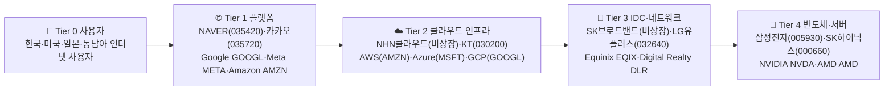

### Tier 1 (플랫폼)
```yaml
tier: 1
role: 광고·커머스·콘텐츠 플랫폼 운영
kr:
  - { name: "NAVER", code: "035420", note: "검색·웹툰·커머스·클라우드" }
  - { name: "카카오", code: "035720", note: "메신저·카카오뱅크·모빌리티" }
  - { name: "쿠팡", code: "CPNG", note: "美 상장 K-이커머스" }
us:
  - { ticker: "GOOGL", note: "검색·YouTube·Android·GCP" }
  - { ticker: "META", note: "Facebook·Instagram·WhatsApp" }
  - { ticker: "AMZN", note: "이커머스+AWS" }
hidden_alpha: NAVER 웹툰(WBTN) 美 상장 — 글로벌 IP 플랫폼화
```

### Tier 2 (클라우드 인프라)
```yaml
tier: 2
role: IaaS/PaaS — AI 추론·웹서비스 백엔드
kr:
  - { name: "KT", code: "030200", note: "MS 협력 GPU 클라우드 추진" }
  - { name: "NHN", code: "181710", note: "NHN클라우드 보유" }
us:
  - { ticker: "AMZN", note: "AWS — 글로벌 1위" }
  - { ticker: "MSFT", note: "Azure — OpenAI 단독 호스팅" }
  - { ticker: "GOOGL", note: "GCP — Gemini·TPU" }
```

### Tier 4 (반도체·서버)
```yaml
tier: 4
role: AI 추론·서비스 인프라 핵심 칩
kr:
  - { name: "삼성전자", code: "005930", note: "HBM3E·서버 DRAM" }
  - { name: "SK하이닉스", code: "000660", note: "HBM 1위" }
us:
  - { ticker: "NVDA", note: "AI GPU H100/B200" }
  - { ticker: "AMD", note: "MI300X·EPYC" }
```

### 한국 소부장 요약표
| Tier | 종목 | 코드 | K-수혜 트리거 |
|---|---|---|---|
| 1 | NAVER | 035420 | 웹툰·커머스 GMV·AI 광고 |
| 1 | 카카오 | 035720 | 카카오톡 광고·선물하기·뱅크 |
| 2 | KT | 030200 | MS 파트너십 AI 클라우드 |
| 4 | SK하이닉스 | 000660 | HBM 공급 — 글로벌 LLM 인프라 직접 수혜 |

---

## 16. 게임

### Mermaid
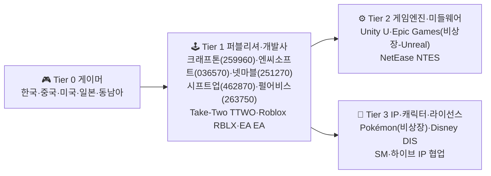

### Tier 1 (퍼블리셔·개발사)
```yaml
tier: 1
role: 게임 기획·개발·서비스
kr:
  - { name: "크래프톤", code: "259960", note: "PUBG·다크앤다커 모바일·인도 1위" }
  - { name: "엔씨소프트", code: "036570", note: "리니지·아이온2·TL" }
  - { name: "넷마블", code: "251270", note: "세븐나이츠·하이브 지분" }
  - { name: "시프트업", code: "462870", note: "스텔라 블레이드·승리의 여신:니케 — 단일 IP 폭발성" }
  - { name: "펄어비스", code: "263750", note: "검은사막·붉은사막(2026 출시 예정)" }
  - { name: "카카오게임즈", code: "293490", note: "오딘·POE2 한국 서비스" }
  - { name: "위메이드", code: "112040", note: "미르·블록체인 게임" }
us:
  - { ticker: "TTWO", note: "GTA·Rockstar — GTA6 2026 슈퍼사이클" }
  - { ticker: "RBLX", note: "UGC 메타버스 플랫폼" }
  - { ticker: "EA", note: "FIFA·Madden·Apex" }
hidden_alpha: 시프트업(462870) 스텔라 블레이드 PC판·차기작 — 단일 흥행 IP 레버리지
```

### Tier 2 (엔진·미들웨어)
```yaml
tier: 2
role: 게임 개발 엔진·도구
us:
  - { ticker: "U", note: "Unity — 모바일 게임 70% 점유" }
  - { ticker: "MSFT", note: "Activision Blizzard 인수 — Xbox·Game Pass" }
non_listed:
  - { name: "Epic Games", note: "Unreal Engine 5 — AAA 표준" }
```

### 한국 소부장 요약표
| Tier | 종목 | 코드 | K-수혜 트리거 |
|---|---|---|---|
| 1 | 크래프톤 | 259960 | PUBG MAU·인도 시장 회복 |
| 1 | 시프트업 | 462870 | 스텔라 블레이드 판매·차기작 |
| 1 | 엔씨소프트 | 036570 | TL 글로벌·아이온2 출시 |
| 1 | 펄어비스 | 263750 | 붉은사막 출시 임박 |

---

## 17. K-콘텐츠/엔터

### Mermaid
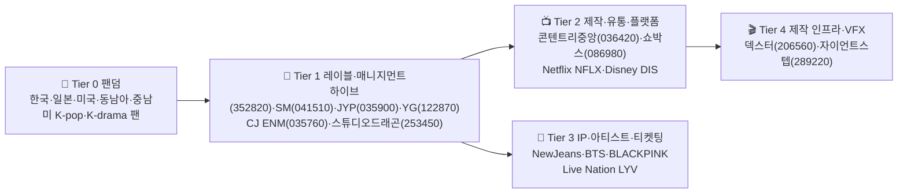

### Tier 1 (레이블·매니지먼트)
```yaml
tier: 1
role: 아티스트 발굴·앨범·콘서트·MD
kr:
  - { name: "하이브", code: "352820", note: "BTS·NewJeans·세븐틴·LE SSERAFIM·美 Geffen 합작" }
  - { name: "SM엔터테인먼트", code: "041510", note: "에스파·NCT·라이즈 — 카카오 자회사" }
  - { name: "JYP Ent.", code: "035900", note: "스트레이키즈·트와이스·NMIXX" }
  - { name: "YG엔터테인먼트", code: "122870", note: "BLACKPINK·BABYMONSTER" }
  - { name: "CJ ENM", code: "035760", note: "tvN·Mnet·KCON·티빙" }
  - { name: "스튜디오드래곤", code: "253450", note: "K-드라마 제작 1위·Netflix 공급" }
hidden_alpha: 하이브(352820) BTS 완전체 컴백(2025 말~2026) + 美 Latin·R&B 레이블 인수 시너지
```

### Tier 2 (제작·유통)
```yaml
tier: 2
role: 영상 제작·OTT·극장 배급
kr:
  - { name: "콘텐트리중앙", code: "036420", note: "JTBC 스튜디오·SLL" }
  - { name: "쇼박스", code: "086980", note: "한국 영화 배급" }
us:
  - { ticker: "NFLX", note: "오징어게임·기생수 등 K-콘텐츠 글로벌 유통" }
  - { ticker: "DIS", note: "Disney+·무빙·삼식이삼촌" }
```

### Tier 4 (VFX·제작 인프라)
```yaml
tier: 4
role: VFX·CG·버추얼 프로덕션
kr:
  - { name: "덱스터스튜디오", code: "206560", note: "한국 VFX 1위" }
  - { name: "자이언트스텝", code: "289220", note: "버추얼 휴먼·메타버스 광고" }
```

### 한국 소부장 요약표
| Tier | 종목 | 코드 | K-수혜 트리거 |
|---|---|---|---|
| 1 | 하이브 | 352820 | BTS 컴백·NewJeans 美 투어 |
| 1 | SM | 041510 | 에스파 美 진출·NCT 일본 |
| 1 | JYP | 035900 | 스트레이키즈 스타디움·NMIXX |
| 1 | 스튜디오드래곤 | 253450 | Netflix·디즈니+ K-드라마 공급 |
| 1 | CJ ENM | 035760 | 티빙 흑전·KCON 글로벌 |

---

## 18. 화장품

### Mermaid
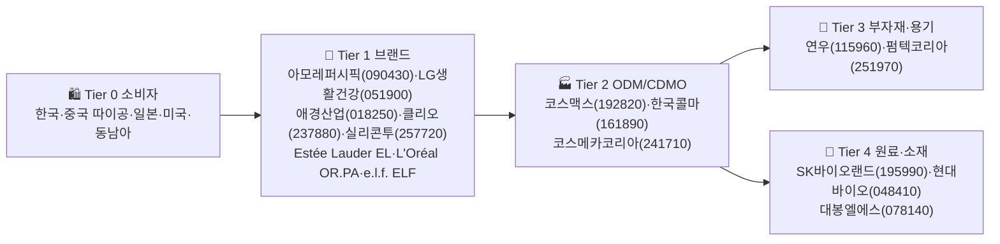

### Tier 1 (브랜드)
```yaml
tier: 1
role: 화장품 기획·마케팅·유통
kr:
  - { name: "아모레퍼시픽", code: "090430", note: "설화수·라네즈·이니스프리·美 라네즈 호조" }
  - { name: "LG생활건강", code: "051900", note: "후·숨·CNP·코카콜라음료" }
  - { name: "애경산업", code: "018250", note: "에이지투웨니스·루나" }
  - { name: "클리오", code: "237880", note: "페리페라·구달·일본 1위 한국 브랜드" }
  - { name: "실리콘투", code: "257720", note: "K-beauty 글로벌 유통 — 美·EU 직진출 인디 브랜드 수혜" }
  - { name: "토니모리", code: "214420", note: "메가코스 자회사" }
us:
  - { ticker: "EL", note: "Estée Lauder — 중국 면세 회복" }
  - { ticker: "ELF", note: "e.l.f. Beauty — 美 인디 폭발성장" }
  - { ticker: "ULTA", note: "Ulta Beauty — 美 K-beauty 코너 확대" }
hidden_alpha: 실리콘투(257720) — K-beauty 인디 브랜드 글로벌 D2C 유통 플랫폼, 美·EU 매출 폭증
```

### Tier 2 (ODM/CDMO) ★ 핵심 hidden alpha
```yaml
tier: 2
role: OEM/ODM — 글로벌 인디 브랜드 직접 수주
kr:
  - { name: "코스맥스", code: "192820", note: "글로벌 ODM 1위·中·美·태국 공장·인디 브랜드 수주" }
  - { name: "한국콜마", code: "161890", note: "ODM 2위·美 생산 거점·HK이노엔 보유" }
  - { name: "코스메카코리아", code: "241710", note: "美 잉글우드랩 — 美 인디 브랜드 직접 수혜" }
  - { name: "씨앤씨인터내셔널", code: "352480", note: "립·아이메이크업 ODM" }
hidden_alpha: 코스맥스(192820)·한국콜마(161890)는 e.l.f.·Rare Beauty 등 글로벌 인디 OEM이라 K-beauty 트렌드 직접 레버리지
```

### Tier 3 (용기·부자재)
```yaml
tier: 3
role: 펌프·튜브·유리병 등 화장품 부자재
kr:
  - { name: "연우", code: "115960", note: "펌프·디스펜서 1위" }
  - { name: "펌텍코리아", code: "251970", note: "에어리스 펌프" }
```

### Tier 4 (원료·소재)
```yaml
tier: 4
role: 기능성 원료·천연 추출물·펩타이드
kr:
  - { name: "현대바이오", code: "048410", note: "비타민C·기능성 원료" }
  - { name: "대봉엘에스", code: "078140", note: "화장품 원료·CDMO" }
  - { name: "선바이오", code: "067370", note: "PEG화 펩타이드" }
```

### 한국 소부장 요약표
| Tier | 종목 | 코드 | K-수혜 트리거 |
|---|---|---|---|
| 1 | 실리콘두 | 257720 | 美·EU K-beauty 인디 D2C 매출 |
| 1 | 클리오 | 237880 | 일본·미국 색조 매출 |
| 2 | 코스맥스 | 192820 | 글로벌 인디 OEM 수주 |
| 2 | 한국콜마 | 161890 | 美 공장 가동·ODM 수주 |
| 2 | 코스메카코리아 | 241710 | 美 잉글우드랩 — 美 직접 |
| 1 | 아모레퍼시픽 | 090430 | 美 라네즈·中 면세 회복 |

---

## 19. 음식료

### Mermaid
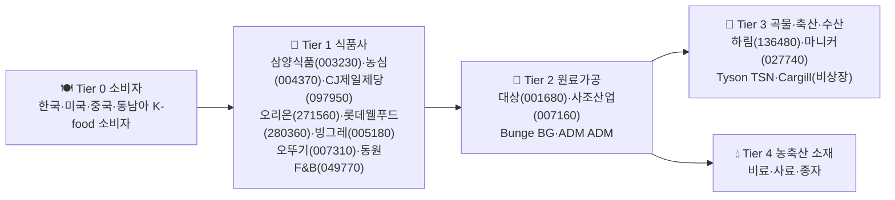

### Tier 1 (식품사) ★ 삼양식품이 핵심
```yaml
tier: 1
role: 가공식품 제조·브랜드·수출
kr:
  - { name: "삼양식품", code: "003230", note: "불닭볶음면 — 美·中·EU 수출이 매출 견인·밀양 공장 증설" }
  - { name: "농심", code: "004370", note: "신라면·짜파게티·美 LA 공장" }
  - { name: "CJ제일제당", code: "097950", note: "비비고·만두·햇반·美 Schwan's" }
  - { name: "오리온", code: "271560", note: "초코파이·中·러·베트남 매출" }
  - { name: "롯데웰푸드", code: "280360", note: "빼빼로·인도 시장" }
  - { name: "빙그레", code: "005180", note: "메로나·바나나우유·美" }
  - { name: "오뚜기", code: "007310", note: "진라면·소스" }
  - { name: "동원F&B", code: "049770", note: "참치·HMR" }
us:
  - { ticker: "MDLZ", note: "Mondelez — 오레오·캐드버리" }
  - { ticker: "KO", note: "Coca-Cola" }
  - { ticker: "PEP", note: "PepsiCo — Frito-Lay·Quaker" }
hidden_alpha: 삼양식품(003230) 불닭 시리즈 美·中 매출이 전체 매출 70%+ — 美 의류소매·해외 K-food 트렌드 직접 레버리지
```

### Tier 2 (원료가공)
```yaml
tier: 2
role: 곡물·전분·당·식용유 가공
kr:
  - { name: "대상", code: "001680", note: "청정원·전분·아미노산" }
  - { name: "사조산업", code: "007160", note: "참치·축산·사료" }
us:
  - { ticker: "ADM", note: "Archer-Daniels-Midland — 곡물 가공 글로벌" }
  - { ticker: "BG", note: "Bunge — 대두·식용유" }
```

### Tier 3 (곡물·축산)
```yaml
tier: 3
role: 닭·돼지·쇠고기·수산물
kr:
  - { name: "하림", code: "136480", note: "닭고기 1위" }
  - { name: "마니커", code: "027740", note: "닭가공" }
us:
  - { ticker: "TSN", note: "Tyson Foods — 美 닭·돼지 1위" }
```

### 한국 소부장 요약표
| Tier | 종목 | 코드 | K-수혜 트리거 |
|---|---|---|---|
| 1 | 삼양식품 | 003230 | 불닭 美·中 수출·밀양 신공장 |
| 1 | 농심 | 004370 | 신라면 美 LA 공장 가동 |
| 1 | CJ제일제당 | 097950 | 비비고 만두 글로벌·바이오 |
| 1 | 오리온 | 271560 | 中·러 매출 회복·신제품 |
| 1 | 롯데웰푸드 | 280360 | 인도 빼빼로·해외 매출 |

---

## 20. 유통/이커머스

### Mermaid
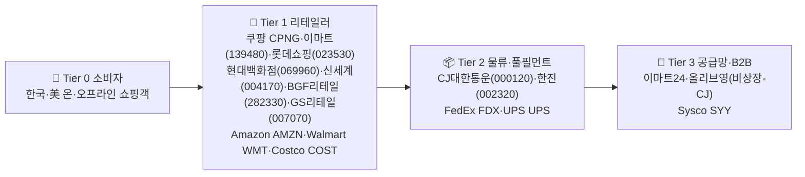

### Tier 1 (리테일러)
```yaml
tier: 1
role: 백화점·대형마트·편의점·이커머스
kr:
  - { name: "쿠팡", code: "CPNG", note: "美 NYSE 상장·로켓배송·대만 진출" }
  - { name: "이마트", code: "139480", note: "트레이더스·SSG·신세계몰" }
  - { name: "롯데쇼핑", code: "023530", note: "백화점·마트·롯데온" }
  - { name: "현대백화점", code: "069960", note: "프리미엄 백화점·면세" }
  - { name: "신세계", code: "004170", note: "백화점·면세점" }
  - { name: "BGF리테일", code: "282330", note: "CU 편의점 1위" }
  - { name: "GS리테일", code: "007070", note: "GS25·GS THE FRESH" }
  - { name: "이마트147(올리브영 보유 CJ)", code: "001040", note: "CJ — K-beauty 오프라인 채널" }
us:
  - { ticker: "AMZN", note: "Amazon — 글로벌 1위" }
  - { ticker: "WMT", note: "Walmart — 美 1위·이커머스 성장" }
  - { ticker: "COST", note: "Costco — 회원제 창고형" }
hidden_alpha: 쿠팡(CPNG) 대만 진출 + 와우 이용자 1,400만 — 한국 이커머스 1위 굳히기, 광고 매출 본격화
```

### Tier 2 (물류·풀필먼트)
```yaml
tier: 2
role: 택배·풀필먼트·콜드체인
kr:
  - { name: "CJ대한통운", code: "000120", note: "택배 1위·이커머스 풀필먼트" }
  - { name: "한진", code: "002320", note: "택배 3위" }
us:
  - { ticker: "FDX", note: "FedEx" }
  - { ticker: "UPS", note: "UPS" }
```

### 한국 소부장 요약표
| Tier | 종목 | 코드 | K-수혜 트리거 |
|---|---|---|---|
| 1 | 쿠팡 | CPNG | 와우 멤버십·대만·광고 매출 |
| 1 | BGF리테일 | 282330 | CU 편의점 K-food·해외 진출 |
| 1 | 이마트 | 139480 | 트레이더스·SSG 흑전 |
| 2 | CJ대한통운 | 000120 | 쿠팡·알리·테무 풀필먼트 |
| 1 | CJ | 001040 | 올리브영 IPO 기대·K-beauty 채널 |

---

## 21. 의류/패션

### Mermaid
```mermaid
graph LR
    T0["👕 Tier 0 소비자<br/>美·EU·한국 의류 소비자"]
    T1["🏷️ Tier 1 브랜드<br/>F&F(383220)·휠라홀딩스(081660)·한섬(020000)·신세계인터내셔날(031430)<br/>Nike NKE·LULU LULU·Adidas ADS.DE·Inditex ITX.MC"]
    T2["🧵 Tier 2 OEM/ODM<br/>한세실업(105630)·영원무역(111770)<br/>호전실업(111380)·태평양물산(007980)"]
    T3["🧶 Tier 3 원사·원단<br/>효성티앤씨(298020)·태광산업(003240)<br/>Hyosung TNC·도레이"]
    T4["🌱 Tier 4 원자재<br/>면화·합성섬유 — 화학·농업"]
    T0 --> T1 --> T2 --> T3 --> T4
```

### Tier 1 (브랜드)
```yaml
tier: 1
role: 브랜드·디자인·마케팅·유통
kr:
  - { name: "F&F", code: "383220", note: "MLB·디스커버리·中 폭발성장" }
  - { name: "휠라홀딩스", code: "081660", note: "Fila·Acushnet(타이틀리스트)" }
  - { name: "한섬", code: "020000", note: "타임·시스템·현대백화점" }
  - { name: "신세계인터내셔날", code: "031430", note: "수입 명품·자체 브랜드" }
  - { name: "LF", code: "093050", note: "헤지스·닥스" }
  - { name: "더네이쳐홀딩스", code: "298540", note: "내셔널지오그래픽 어패럴" }
us:
  - { ticker: "NKE", note: "Nike — 글로벌 1위" }
  - { ticker: "LULU", note: "Lululemon — 애슬레저" }
  - { ticker: "ITX.MC", note: "Inditex(Zara) — SPA" }
  - { ticker: "ADS.DE", note: "Adidas" }
hidden_alpha: F&F(383220) MLB 中·동남아 매출 + 디스커버리 — 단일 브랜드 글로벌 침투
```

### Tier 2 (OEM/ODM) ★ 핵심 hidden alpha
```yaml
tier: 2
role: 글로벌 브랜드 위탁생산 — 美 의류소매 직접 레버리지
kr:
  - { name: "한세실업", code: "105630", note: "Nike·Target·GAP OEM·중남미 생산" }
  - { name: "영원무역", code: "111770", note: "노스페이스·룰루레몬·파타고니아 OEM" }
  - { name: "호전실업", code: "111380", note: "스포츠웨어 OEM" }
  - { name: "태평양물산", code: "007980", note: "다운점퍼·아웃도어 OEM" }
  - { name: "화승엔터프라이즈", code: "241590", note: "Adidas 신발 OEM" }
hidden_alpha: 한세실업(105630)·영원무역(111770) — Nike·LULU OEM 점유율 높아 美 의류소매 매출 직접 leveraged. 美 소비 회복 시 OEM 가동률 즉각 반영
```

### Tier 3 (원사·원단)
```yaml
tier: 3
role: 스판덱스·폴리에스터·나일론 원사
kr:
  - { name: "효성티앤씨", code: "298020", note: "스판덱스 글로벌 1위" }
  - { name: "태광산업", code: "003240", note: "스판덱스·아라미드" }
  - { name: "휴비스", code: "079980", note: "폴리에스터 단섬유" }
```

### Tier 4 (원자재)
```yaml
tier: 4
role: 면화·석유화학 기반 합성섬유 원료
us:
  - { ticker: "BASF.DE", note: "BASF — 화학 원료" }
  - { ticker: "DOW", note: "Dow — 폴리머" }
note: 면화는 ICE Cotton 선물·축산·농업 사이클 동조
```

### 한국 소부장 요약표
| Tier | 종목 | 코드 | K-수혜 트리거 |
|---|---|---|---|
| 1 | F&F | 383220 | MLB 中 매출·디스커버리 |
| 1 | 휠라홀딩스 | 081660 | Acushnet·골프 의류 |
| 2 | 한세실업 | 105630 | Nike·GAP OEM 가동률 |
| 2 | 영원무역 | 111770 | LULU·노스페이스 OEM |
| 2 | 화승엔터프라이즈 | 241590 | Adidas 신발 OEM |
| 3 | 효성티앤씨 | 298020 | 스판덱스 글로벌 1위 |

---

## 종합 핵심 요약

| 섹터 | 핵심 K-종목 (Tier·Hidden Alpha) | 트리거 이벤트 |
|---|---|---|
| 인터넷 | NAVER(035420) Tier1 / SK하이닉스(000660) Tier4 | 웹툰·HBM 수요 |
| 게임 | 시프트업(462870) Tier1 / 크래프톤(259960) Tier1 | 단일 IP 흥행 |
| K-콘텐츠 | 하이브(352820) Tier1 / 스튜디오드래곤(253450) Tier1 | BTS 컴백·Netflix K-드라마 |
| 화장품 | 코스맥스(192820)·한국콜마(161890) Tier2 / 실리콘투(257720) Tier1 | 美 인디 K-beauty 폭증 |
| 음식료 | 삼양식품(003230) Tier1 | 불닭 美·中 수출 |
| 유통 | 쿠팡(CPNG) Tier1 / CJ대한통운(000120) Tier2 | 와우 멤버십·풀필먼트 |
| 의류 | 한세실업(105630)·영원무역(111770) Tier2 / F&F(383220) Tier1 | Nike·LULU OEM 가동률 |

---

## 참고
- Tier 정의: Phase 1과 동일 (T0 소비자 → T1 브랜드/플랫폼 → T2 ODM/OEM/엔진 → T3 부자재/유통 → T4 원료/원자재 → T5 원자재 채굴/생산)
- 일부 섹터는 T5까지 닿지 않음 (인터넷·게임·콘텐츠는 T4에서 종결)
- 비상장 기업은 `(비상장)` 표기, 한국 종목은 `(6자리)`, 미국 종목은 ticker

---

# Part D — 전통+알파 6개 섹터 Value Chain

# Phase 3-4 — 인프라/전통주 + 숨은 알파 Value Chain

> 한국 투자자 관점: "금리 인하 → 어느 금융주?" "관광 회복 → 어느 카지노?" 즉답 매핑.
> KR 종목명(6자리) · US 공식 ticker · Tier 0(수요) → Tier 5(원자재/반도체).

---

## 22. 건설/건자재

### Mermaid
```mermaid
graph LR
    T0["🏠 Tier 0 수요<br/>분양 수요·정부 SOC<br/>1기 신도시 재건축"]
    T1["🏗️ Tier 1 시공<br/>현대건설(000720)·삼성물산(028260)<br/>대우건설(047040)·GS건설(006360)<br/>DL이앤씨(375500)·HDC현대산업(294870)"]
    T2["🛗 Tier 2 설비·기계<br/>현대엘리베이(017800)<br/>두산에너빌리티(034020) 플랜트<br/>CAT(US)·DE(US) 중장비"]
    T3["🧱 Tier 3 자재<br/>KCC(002380) 도료·유리<br/>LX하우시스(108670) 창호<br/>한샘(009240) 인테리어"]
    T4["🪨 Tier 4 원재료<br/>한일시멘트(300720)·쌍용C&E(003410)<br/>현대제철(004020) 철근<br/>이건산업(008250) 목재"]
    T5["⛏️ Tier 5 광물<br/>석회석·철광석·원유(역청)<br/>VALE(US)·CLF(US)"]
    T0 --> T1 --> T2
    T1 --> T3 --> T4 --> T5
```

### 한국 소부장 요약표

| Tier | 종목 | 역할 | Hidden Alpha |
|------|------|------|--------------|
| T1 | 현대건설(000720) | 대형 시공·해외 플랜트 | 사우디 네옴 수주 |
| T1 | DL이앤씨(375500) | 주택·플랜트 | 분양가 상한제 해제 직접 수혜 |
| T2 | 두산에너빌리티(034020) | 원전·플랜트 EPC | SMR 모멘텀 (24번 섹터와 교차) |
| T3 | KCC(002380) | 도료·유리·실리콘 | 분양 후행 수혜 6~12개월 |
| T3 | 한샘(009240) | 인테리어·B2C | 거래량 회복 시 영업 레버리지 |
| **T4** | **한일시멘트(300720)** | **시멘트** | **★ 분양 폭발 18개월 후 출하량 피크** |
| **T4** | **쌍용C&E(003410)** | **시멘트 #1** | **★ 환경규제·전기료 인상 시 가격 전가력** |
| T4 | 현대제철(004020) | 철근·H형강 | 건설+자동차 dual exposure |

> **Hidden Alpha**: 시공사보다 **시멘트(한일·쌍용)**가 분양 사이클 후행 수혜. 분양 → 착공 → 골조 시점이 12~18개월 시차라 시공사 호재 후 자재주가 늦게 폭발.

---

## 23. 금융

### Mermaid
```mermaid
graph LR
    T0["👥 Tier 0 수요<br/>개인 투자자·기업·외국인<br/>금리 인하 → 대출·증권 거래량↑"]
    T1["🏦 Tier 1 은행·증권·보험<br/>KB금융(105560)·신한지주(055550)·하나금융(086790)<br/>우리금융(316140)·메리츠금융(138040)<br/>미래에셋증권(006800)·키움증권(039490)·한국금융지주(071050)<br/>삼성생명(032830)·삼성화재(000810)"]
    T2["🏛️ Tier 2 인프라·핀테크<br/>한국거래소(비상장)<br/>다우데이타(032190) 코스콤 SI<br/>KG이니시스(035600)·NHN KCP(060250)<br/>카카오페이(377300)·토스(비상장)"]
    T3["💳 Tier 3 글로벌<br/>JPM(US)·BAC(US)·GS(US)·MS(US)<br/>V(US)·MA(US) 결제"]
    T0 --> T1 --> T2 --> T3
```

### 한국 소부장 요약표

| Tier | 종목 | 역할 | Hidden Alpha |
|------|------|------|--------------|
| T1 | KB금융(105560) | 1위 은행지주 | 금리 인하 시 NIM 압축 vs 대출 증가 trade-off |
| T1 | 메리츠금융(138040) | 통합지주·자사주 소각 | 주주환원 100% 정책 |
| T1 | **키움증권(039490)** | **개인 brokerage 1위** | **★ 거래대금 회복 시 영업 레버리지 최강** |
| T1 | 미래에셋증권(006800) | IB·해외주식 | 미국주식 거래량 직접 노출 |
| T1 | 삼성생명(032830) | 생보 #1 | IFRS17 + 금리 인하 = K-ICS 비율 변동 |
| **T2** | **다우데이타(032190)** | **키움증권 지주** | **★ 키움 거래대금 폭발의 레버리지 wrapper** |
| T2 | KG이니시스(035600) | PG 결제 | 이커머스·여행 회복 inflow |
| T2 | NHN KCP(060250) | PG | 글로벌 가맹점 확대 |
| T3 | JPM(US) | 미국 은행 #1 | 연준 정책 직접 베타 |

> **Hidden Alpha**: KRX 거래소가 비상장이라 직접 베팅 불가. 대신 **다우데이타(032190)**가 키움증권 지주로 거래대금 폭발 시 더블 레버리지. **키움증권** 자체보다 지주 다우데이타가 PBR 디스카운트로 더 폭발적.

---

## 24. 통신/유틸리티

### Mermaid
```mermaid
graph LR
    T0["📱 Tier 0 수요<br/>가입자·기업 IDC·정부<br/>5G·AI 데이터 트래픽 폭발"]
    T1["📡 Tier 1 통신·전력<br/>SK텔레콤(017670)·KT(030200)·LG유플러스(032640)<br/>한국전력(015760)·한국가스공사(036460)<br/>T(US)·VZ(US)·TMUS(US)<br/>NEE(US)·D(US) 유틸리티"]
    T2["🛰️ Tier 2 장비<br/>케이엠더블유(032500) 5G 안테나<br/>쏠리드(050890) 중계기<br/>다산네트웍스(039560)<br/>유비쿼스(264450) 광전송<br/>RBLX(US) 광케이블"]
    T3["🔧 Tier 3 부품<br/>이노와이어리스(073490) 시험계측<br/>오이솔루션(138080) 광트랜시버<br/>HFR(230240) 광다중화"]
    T4["💾 Tier 4 칩셋<br/>QCOM(US) 5G 모뎀·기지국<br/>MRVL(US) 광통신 SoC<br/>AVGO(US) 네트워크"]
    T5["🧪 Tier 5 소재<br/>광섬유 프리폼·구리<br/>FCX(US) 구리"]
    T0 --> T1 --> T2 --> T3 --> T4 --> T5
```

### 한국 소부장 요약표

| Tier | 종목 | 역할 | Hidden Alpha |
|------|------|------|--------------|
| T1 | SK텔레콤(017670) | 통신 #1·AI 피보팅 | 5G ARPU + AI 사업부 분리 가치 |
| T1 | KT(030200) | 통신·IDC | IDC·B2B AI 인프라 |
| T1 | 한국전력(015760) | 전력 독점 | 전기료 인상 + 원전 확대 시 흑자 전환 |
| T1 | 한국가스공사(036460) | 도시가스·LNG | 미수금 회수 + LNG 가격 전가 |
| **T2** | **케이엠더블유(032500)** | **5G 안테나·MMU** | **★ 글로벌 5G 재투자 사이클 직접 노출** |
| T2 | 쏠리드(050890) | 중계기·DAS | 미국 in-building 5G 수요 |
| T2 | 유비쿼스(264450) | 광전송장비 | KT·SKT capex 직접 노출 |
| T3 | 오이솔루션(138080) | 광트랜시버 | AI 데이터센터 800G 광모듈 (1번 섹터 교차) |
| T4 | QCOM(US) | 5G 모뎀 | 갤럭시·아이폰 dual sourcing |

> **Hidden Alpha**: **케이엠더블유(032500)**는 노키아·삼성네트웍스 vendor로 글로벌 5G 재투자 시 직접 베타. 통신 3사보다 capex 사이클 변동성이 훨씬 커서 비대칭 upside.

---

## 25. 지주사/리츠

### Mermaid
```mermaid
graph LR
    T0["💰 Tier 0 주주·자금<br/>일반주주·기관·국민연금<br/>밸류업 프로그램·상속세 이슈"]
    T1["🏢 Tier 1 지주<br/>삼성물산(028260)·SK(034730)·LG(003550)<br/>한화(000880)·CJ(001040)·GS(078930)<br/>현대차(005380) 그룹 cross-holding"]
    T2["🏬 Tier 2 리츠<br/>SK리츠(395400) 주유소·SK 사옥<br/>롯데리츠(330590) 백화점·마트<br/>ESR켄달스퀘어리츠(365550) 물류센터<br/>제이알글로벌리츠(348950) 해외 오피스<br/>O(US)·VNQ(US)"]
    T3["🏭 Tier 3 자회사·기초자산<br/>삼성전자·SK하이닉스·LG화학<br/>오피스·물류센터·주유소"]
    T0 --> T1 --> T3
    T0 --> T2 --> T3
```

### 한국 소부장 요약표

| Tier | 종목 | 역할 | Hidden Alpha |
|------|------|------|--------------|
| T1 | **삼성물산(028260)** | **삼성그룹 지주격** | **★ 이재용 상속·삼바 지분·밸류업 트리플 트리거** |
| T1 | SK(034730) | SK그룹 지주·하이닉스 | NAV 디스카운트 70%+ |
| T1 | LG(003550) | LG그룹 지주 | 자사주 소각·배당 증액 |
| T1 | 한화(000880) | 한화그룹 지주 | 한화에어로 분할 가치 재평가 |
| T1 | CJ(001040) | CJ그룹 지주·CJ제일제당 | 음식료 + 엔터(스튜디오드래곤) |
| T2 | SK리츠(395400) | SK 사옥·주유소 | 금리 인하 직접 수혜 + SK 임대 안정성 |
| T2 | ESR켄달스퀘어리츠(365550) | 물류센터 | 이커머스 회복 + 금리 |
| T2 | 롯데리츠(330590) | 롯데 백화점·마트 | 임대료 인상 + 모회사 신용도 |

> **Hidden Alpha**: **삼성물산(028260)**은 단순 지주가 아니라 ① 이재용 상속세 매각 압력 해소 ② 삼성바이오로직스 43% 지분 ③ 밸류업 자사주 소각의 트리플 트리거. NAV 대비 50%+ 디스카운트로 한국 밸류업 최대 수혜.

---

## 26. 의료기기/미용

### Mermaid
```mermaid
graph LR
    T0["🏥 Tier 0 수요<br/>피부과·미용 클리닉<br/>한·중·일·미·동남아<br/>GLP-1 후 시술 수요 폭발"]
    T1["⚙️ Tier 1 미용기기<br/>클래시스(214150) 슈링크·올리지오<br/>비올(335890) 실펌X<br/>제이시스메디칼(287410) 포텐자<br/>원텍(336570) 올리지오 OEM<br/>루트로닉(085370) 비상장화"]
    T2["💉 Tier 2 톡신·필러<br/>메디톡스(086900)·휴젤(145020)<br/>대웅제약(069620) 나보타<br/>파마리서치(214450) 리쥬란"]
    T3["🩺 Tier 3 의료기기<br/>삼성메디슨(비상장)·인바디(041830)<br/>덴티움(145720)·오스템임플란트(비상장)<br/>ISRG(US)·MDT(US)·SYK(US)·BSX(US)"]
    T4["🔌 Tier 4 부품<br/>RF·HIFU 모듈·레이저 다이오드<br/>리노공업(058470) 프로브(7번 교차)"]
    T5["💾 Tier 5 센서·반도체<br/>이미지센서·MCU<br/>STM(US)·TXN(US) 아날로그"]
    T0 --> T1 --> T4 --> T5
    T0 --> T2
    T0 --> T3 --> T4
```

### 한국 소부장 요약표

| Tier | 종목 | 역할 | Hidden Alpha |
|------|------|------|--------------|
| **T1** | **클래시스(214150)** | **슈링크·올리지오 자체 OEM** | **★ 영업이익률 50%+ FDA 510(k) 통과 시 미국 진출** |
| **T1** | **비올(335890)** | **실펌X 마이크로니들 RF** | **★ 미국 FDA 승인 + 일본 매출 폭발** |
| T1 | 제이시스메디칼(287410) | 포텐자·울트라셀Q+ | 솔타메디칼 OEM 매출 |
| T1 | 원텍(336570) | 올리지오 OEM | 클래시스 의존도 리스크 |
| T2 | 메디톡스(086900) | 톡신 #1 | 휴젤 소송 종결 |
| T2 | 휴젤(145020) | 톡신·미국 진출 | GS그룹 인수 후 미국 FDA 보툴렉스 |
| T2 | 파마리서치(214450) | 리쥬란·PDRN | 중국 수출 회복 |
| T3 | 인바디(041830) | 체성분 분석기 | 글로벌 헬스장·병원 표준 |
| T3 | 덴티움(145720) | 임플란트 | 중국 VBP 영향 완화 |
| T4 | 리노공업(058470) | 프로브핀 | 반도체 + 의료기기 dual |

> **Hidden Alpha**: 한국 미용기기 3사(**클래시스·비올·제이시스**)는 모두 자체 OEM 생산이라 영업이익률 40~55%로 글로벌 솔타·인모드 대비 압도적. **FDA 510(k) 승인**이 미국 진출 트리거 — 비올은 이미 통과, 클래시스 올리지오는 진행 중.

---

## 27. 호텔/레저/여행

### Mermaid
```mermaid
graph LR
    T0["✈️ Tier 0 수요<br/>관광객(중·일·동남아·한국 outbound)<br/>★ 중국 단체관광 비자 = 구조적 trigger"]
    T1["🏨 Tier 1 호텔·카지노·여행사<br/>호텔신라(008770) 면세점·호텔<br/>신세계(004170) 면세점<br/>파라다이스(034230) 외국인 카지노<br/>GKL(114090) 그랜드코리아 카지노<br/>강원랜드(035250) 내국인 카지노<br/>하나투어(039130)·모두투어(080160)<br/>야놀자(비상장)·LVS(US)·WYNN(US)·MAR(US)"]
    T2["🛫 Tier 2 인프라<br/>대한항공(003490)·아시아나(020560)<br/>제주항공(089590)·티웨이(091810)<br/>진에어(272450)·에어부산(298690)<br/>인천공항공사(비상장)<br/>AAL(US)·DAL(US)·UAL(US)·LUV(US)"]
    T3["⚙️ Tier 3 항공기·MRO<br/>BA(US) 보잉·EADSY(EADSY) 에어버스<br/>한국항공우주(047810) MRO 일부"]
    T0 --> T1 --> T2 --> T3
```

### 한국 소부장 요약표

| Tier | 종목 | 역할 | Hidden Alpha |
|------|------|------|--------------|
| **T1** | **호텔신라(008770)** | **면세점·신라호텔** | **★ 중국 단체관광 비자 + 따이공 회복** |
| T1 | 신세계(004170) | 면세점·백화점 | 인천공항 면세 임대료 재협상 |
| **T1** | **파라다이스(034230)** | **외국인 전용 카지노** | **★ 일본·중국 VIP 회복 직접 베타** |
| T1 | GKL(114090) | 외국인 카지노 (공기업) | 마카오 대체 수요 |
| T1 | 강원랜드(035250) | 내국인 카지노 #1 | 내수 회복 + 특별법 연장 |
| **T1** | **하나투어(039130)** | **여행사 #1** | **★ outbound 회복 패키지 단가↑** |
| T1 | 모두투어(080160) | 여행사 #2 | 일본·동남아 단거리 강세 |
| T2 | 대한항공(003490) | FSC #1 | 아시아나 합병 시너지 |
| T2 | 제주항공(089590) | LCC #1 | 일본·동남아 단거리 |
| T2 | 진에어(272450) | LCC | 한진그룹 LCC 통합 가능성 |

> **Hidden Alpha**: **중국 단체관광 비자 재개**가 면세점·카지노·여행사 트리플 trigger. 호텔신라는 따이공(보따리상) 매출 회복 시 영업 레버리지 폭발. 파라다이스는 일본·중국 VIP drop 직접 노출로 카지노 중 변동성 최강.

---

## 교차 참조

- **건설 T2 두산에너빌리티** ↔ Phase 3-3 24번(SMR/원자력) Tier 1
- **통신 T3 오이솔루션** ↔ Phase 3-1 1번(AI/반도체) 광모듈
- **의료기기 T4 리노공업** ↔ Phase 3-1 7번(반도체 후공정) 프로브
- **금융 T2 다우데이타** ↔ 키움증권 지주 wrapper (PBR 디스카운트)
- **지주 T1 삼성물산** ↔ 삼성바이오 + 밸류업 + 상속 트리플 노출

---

## 변경 이력

- 2026-04-25: Phase 3-4 초안 작성 — 건설·금융·통신·지주·의료기기·호텔 6개 섹터, 각 Tier 0~5(서비스 섹터는 0~3) Mermaid + 소부장표 + Hidden Alpha

---

# 종합 Hidden Alpha (전체 27개 섹터 통합)

## 반도체 / AI
- **솔브레인(357780)·한솔케미칼(014680)** — HBM TSV 식각액 글로벌 1위. NVDA HBM 가이던스 → 3-6개월 시차 수혜
- **에스비비테크(389500)** — Optimus 감속기 국산화, 휴머노이드 사이클의 진짜 알파
- **원익IPS(240810)·주성엔지(036930)** — Tier 3 장비 한국 알파

## 바이오 / 헬스
- **에스티팜(237690)** — 올리고뉴클레오타이드 글로벌 2위, GLP-1 capex 부족 시 12-18개월 알파
- **펩트론(217340)** — GLP-1 펩타이드 CDMO + 지속형 IP. LLY/NVO보다 더 선명한 병목 수혜
- **클래시스(214150)·비올(335890)·제이시스메디칼(287410)** — 자체 OEM 영업이익률 40-55%, FDA 510(k) 승인이 미국 진출 trigger

## 한국 제조 / 소부장
- **SKIET(361610)** — 분리막. IRA FEOC 중국 분리막 배제 시 ASP 프리미엄 — 시장이 공급과잉 우려로 저평가
- **에코프로비엠(247540)·포스코퓨처엠(003670)** — 양극재. 리튬 -50% → 6-9개월 후 마진 회복
- **효성첨단소재(298050)** — 수소탱크 탄소섬유 Toray 대체

## 소비재 / 콘텐츠
- **코스맥스(192820)·한국콜마(161890)·코스메카코리아(241710)** — 화장품 ODM. e.l.f.·Rare Beauty OEM, K-beauty + 글로벌 인디 폭발 **이중 레버리지**
- **삼양식품(003230)** — 불닭, 미·중 수출 70%+. 사실상 한국기업 아닌 글로벌 식품주
- **한세실업(105630)·영원무역(111770)** — Nike·LULU OEM. 베트남 생산이라 베트남 GSO 통계가 진짜 lead
- **시프트업(462870)** — 스텔라 블레이드 글로벌 IP, 단일 IP 폭발성

## 인프라 / 전통주
- **한일시멘트(300720)·쌍용C&E(003410)** — 분양 사이클 12-18개월 후행 자재주
- **다우데이타(032190)** — 키움증권 wrapper, 거래대금 폭발 시 PBR 디스카운트로 **더블 레버리지**
- **케이엠더블유(032500)** — 노키아·삼성 vendor, 글로벌 5G 재투자 비대칭 upside
- **삼성물산(028260)** — 상속 + 삼바 43% + 밸류업 **트리플 트리거**, NAV 50%+ 디스카운트

## 호텔 / 관광
- **호텔신라(008770)·파라다이스(034230)·하나투어(039130)** — 중국 단체관광 비자 재개 triple trigger

---

# 양자컴퓨팅 — 한국 알파 부족 명시

양자컴퓨팅은 한국 직접 노출 약함 (5개 KR 종목만 식별, 모두 indirect). **억지 매핑 회피** — 이 섹터는 미국 IBM/IONQ/RGTI/QBTS·중국 정부 R&D에 직접 노출 가능한 ETF 활용 권장. 헬륨-3 같은 원자재 병목은 [[01-commodities]] 참조.

---

# 운영 규칙

- **v1 잠금 (2026-04-25)** — 27개 섹터 Tier 매핑 최종 확정
- 종목 추가/제외는 가능, Tier 구조와 인과 관계 변경은 별도 v2로
- 분기별 사후 검증: `Output/value-chain-backtest-YYYY-Q.md`
- 신호 전이 시차 (signal_map의 +T 표기)는 historical event 기반 추정치
- **관련**: [[01-commodities]] (원자재 매트릭스), [[02-indicators]] (선행 지표), [[03-outlook]] (거시 전망)
